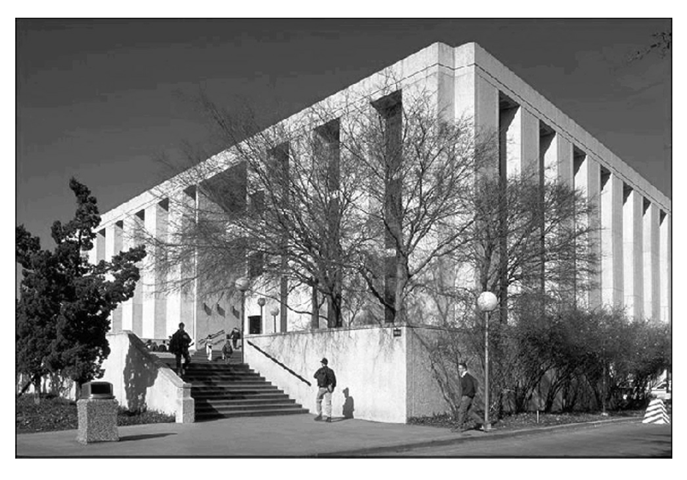
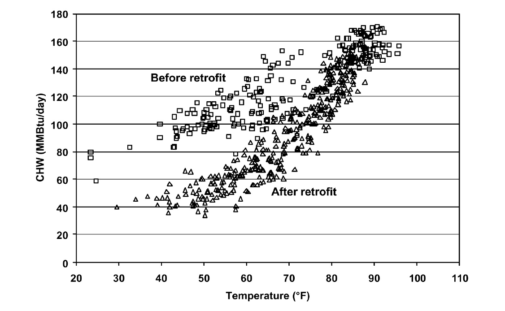
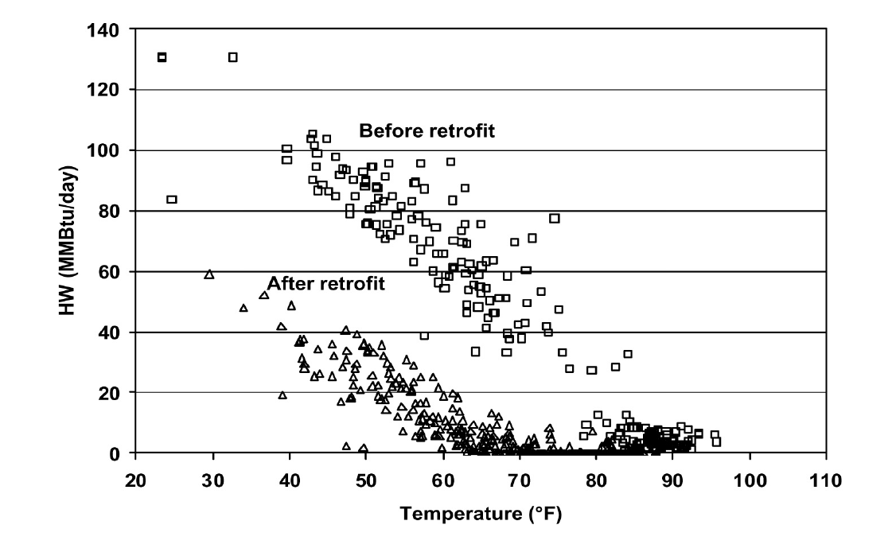
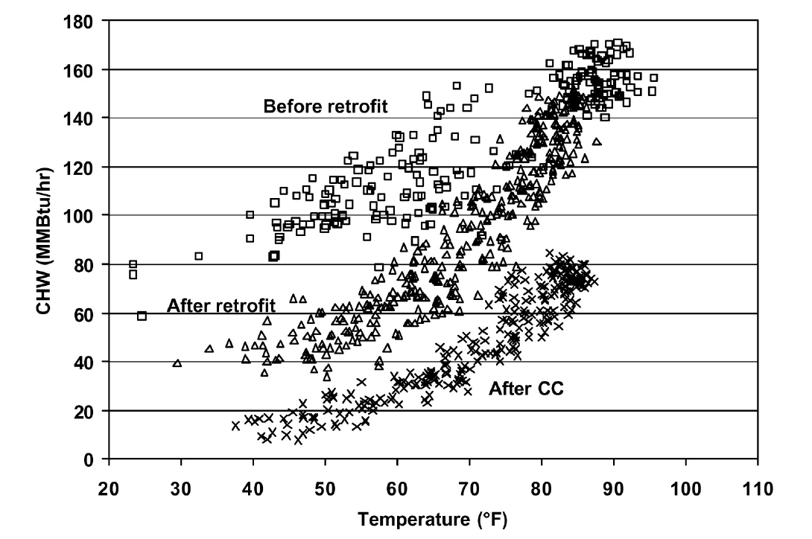
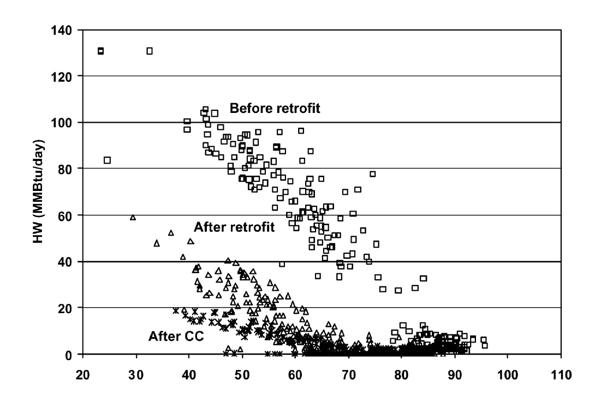
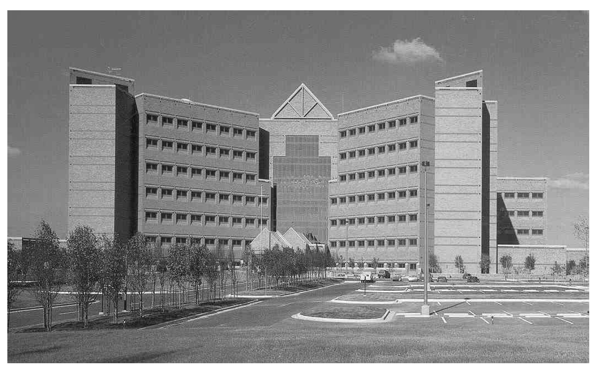

连续调试的案例
==================================

Two detailed CCSM projects are presented to demonstrate the process and the energy efficiency and comfort improvements. Although numerous case studies were presented throughout the guidelines, the complete presentations of the case studies provide opportunities for readers to understand and learn the detailed techniques. The first case study is the Zachry Engineering Center (ZEC) located on the Texas A&M University Campus, College Station, Texas. The CCSM was conducted after a successful energy retrofit. The second example is the Brooke Army Medical Center (BAMC) located in San Antonio, Texas. The CCSM was conducted three years after completion of the building. This is considered as a CCSM project for a new building.

项目 1: Zachry工程中心连续调试
-----------------------------------------------------------------

Zachry Engineering Center (ZEC) is a 340,000 sq.ft. teaching and research building, located on the Texas A&M University campus. The building has four floors and a heated-only parking garage in the basement. It was constructed in the early 1970s and has heavy concrete floors and insulated exterior walls made of pre-cast concrete and porcelain-plated steel panels. Approximately 12% of the exterior wall area is covered with single-pane, bronze-tinted glazing. The windows are recessed approximately four feet from the exterior walls, providing some shading. 
Approximately 3,100 sq.ft. of northeast-facing clerestory windows admit daylight into the core of the building.

    Figure A-1. The Zachry Engineering Center (ZEC) on the Texas A&M Campus

The ZEC includes offices, classrooms, laboratories and computer rooms and is open 24 hours per day, 365 days per year with heaviest occupancy during normal working hours between 8 a.m. and 6 p.m. on weekdays. Occupancy, electrical consumption and chilled/hot water consumption show marked weekday/weekend differences with peak weekend electrical consumption less than 10% above the nightly minimum. Weekday holiday occupancy is similar to weekend usage with intermediate usage on weekdays between semesters when class rooms are not in use, but laboratories and offices are occupied.

**Original HVAC Systems**

Twelve identical dual-duct constant volume systems with 40 hp. fans rated at 35,000 cfm and eight smaller air handlers (3 hp. average) supply air to the zones in the building. Supply and return air ducts are located around the perimeter of the building. These were operated with a constant outdoor air intake at a nominal value of 10% of design flow. Additional information about the building can be found in Katipamula and Claridge [1992a, 1992b], Bronson [1992], Bronson, et al. [1992], and Haberl, et al. [1993, 1995].

**Monitoring of energy use**

Approximately 50 channels of hourly data have been collected and recorded each week for the Zachry Engineering Center since May 1989. The sensors are scanned every 4 seconds and the values are integrated to give hourly totals or averages as appropriate. The important channels for savings measurement are those for air handler electricity consumption and whole-building heating and cooling energy use. Air handler electricity consumption is measured at the building’s motor control center (MCC) and represents all of the air-handling units and most of the heating, ventilating, and air-conditioning-related HVAC pumps in the building. Cooling and heating energy use are determined by a Btu meter which integrates the monitored fluid flow rate and temperature difference across the supply and return lines of the chilled and hot-water supply to the building. Most of the 50 channels of monitored information come from one air handler that is highly instrumented [Katipamula and Claridge 1992a].

**HVAC System Retrofit**

An energy audit of the Zachry Engineering Center was conducted in 1986 [TECCP, 1986]. This audit recommended a lighting retrofit to convert the four-lamp fixtures to three-lamp fixtures with reflectors, conversion of the large dual-duct constant air volume (DDCAV) systems to dual-duct variable-air volume (DDVAV) systems, and a connection to the campus energy management and control system (EMCS). The lighting retrofit was projected to save 975,600 kWh/yr of electricity, 2,500 MMBtu/yr of chilled water and increase hot water use by 832 MMBtu/yr with a payback of 4.4 years. The variable air volume (VAV) conversion, with controls improvements, was projected to save 1,952,776 kWh/yr on fan power, 115 MMBtu/yr of hot water and 265 MMBtu/yr of chilled water. The simple payback is 3.3 years. The university chose not to implement the lighting retrofit, but had variable speed drives installed on the twelve large AHUs, replaced the constant volume dual-duct terminal boxes with VAV dual-duct terminal boxes and connected the building to the campus automated control system.

The audit proposed that the DDCV be converted to DDVAV systems before installing variable speed drives on 24 fans with associated static pressure sensors and controls. The existing constant volume terminal boxes which typically operated at static pressures above 0.5 in. H2O, were to be replaced by DDVAV boxes with independent controls on the hot decks and cold decks to provide constant minimum flow rates of 0.65 cfm/sq.ft. The new boxes and controls were to be tied to the campus EMCS. This was intended to permit shutdown of heating and cooling to non-critical areas such as classrooms during unoccupied hours by closing the dampers in the VAV boxes while the fans continued to supply heating and cooling to laboratory areas. The repair and upgrade of the existing EMCS in the building was intended to control time-of-day settings, DDVAV box load group override, hot and cold deck reset, optimal start-stop of a load group DDVAV box to ensure space comfort, and space temperature reset.

After the building was retrofitted in 1991, fan power, chilled water consumption, and hot water consumption all dropped substantially. The fan power dropped from virtually constant consumption, approximately 350 kW before the retrofit as shown in Figure A-2, to consumption that varied from approximately 180 kW below 50°F to approximately 200 kW between 68°F and 86°F.

.. figure:: _static/FigureA_2.png
    :align: center
    :figwidth: 600px

    Figure A-2. ZEC Daily MCC Consumption in 1990 Before the Retrofit, in 1994 After the Retrofit

Chilled water use dropped substantially as well. Figure A-3 shows the daily chilled water consumption (MMBtu/day) in 1990 and 1994 as a function of daily average ambient temperature. Before the retrofit, the consumption depended almost linearly on the ambient temperature, increasing from approximately 95 MMBtu/day at 40°F to approximately 160 MMBtu/day at 86°F. The consumption following the retrofit was approximately the same at high temperatures, but dropped quite rapidly to about 85 MMBtu/day at 70°F and then dropped more slowly to about 43 MMBtu/day at 31°F. There is, of course, considerable scatter due to variation of ambient humidity conditions and certain operating practices. The general linear and piece-wise linear behavior of the chilled water consumption of the DDCV and DDVAV systems respectively, are consistent with the theoretically expected system behavior [Kissock et al. 1998].

The measured daily hot water consumption values for 1990 and 1994 are shown in Figure A-4. Summer use of hot water was essentially eliminated and peak winter consumption cut in half.

The annualized savings estimated in the audit and the savings determined from the measured consumption data, before and after the retrofit, are shown in Table A-1. The “measured” savings correspond to those for 1994, which was chosen as a typical year after the retrofit and before the Continuous CommissioningSM process was applied to the building. The fan power savings were determined by subtracting 1994 hourly consumption values from the average hourly fan power consumption before the retrofit. The fractional reduction in fan consumption is very close to that projected in the audit, but the consumption reduction is substantially smaller than expected since the audit engineers overestimated the original fan power.

    Figure A-3. ZEC Daily Chilled Water Consumption in 1990 Before the Retrofit and in 1994 After the Retrofit

    Figure A-4. ZEC Daily Hot Water Consumption in 1990 Before the Retrofit and in 1994 After the Retrofit

The annual chilled water and hot water savings have been determined using a
process that normalizes the savings from the retrofit and the subsequent CCSM process to the same weather year. The process calibrated a simulation program (AirModel) [Liu and Claridge 1998] to the measured consumption for one year prior to the retrofit (1989-90), one year after the retrofit (1994) and one year after the CCSM process was applied (1997). Each of the three calibrated simulations were then run using 1994 weather data and compared to determine the annualized savings.

.. table:: Table A-1. Retrofit Savings for the Zachry Building
        :align: center

        =============    =====  ================   ====   ===============  
           ---             --   Savings            --     --
        -------------    -----  ----------------   ----   ---------------                      
           ---           Audit  Estimated          --       Measured
        =============    =====  ================   ====   ===============                 
        Fan power        40%    1,952,764kWh/yr    44%    1,300,000kWh/yr
        Chilled Water    37%    26,600MMBtu/yr     23%    10,500MMBtu/yr
        Heating Water    49%    11,500MMBtu/yr     84%    15,900MMBtu/yr
        =============    =====  ================   ====   ===============

This process resulted in the weather-normalized “measured” chilled water and heating water savings shown in Table A-1. Both the fractional chilled water savings and the reduction in chilled water consumption were substantially smaller than projected in the audit. The audit engineers again overestimated pre-retrofit consumption -- in this case by more than 50%. On the other hand, both the fractional hot water savings and the consumption reduction were larger than expected.

**Continuous CommissioningSM of the Zachry Engineering Center**

The Continuous CommissioningSM process described earlier was applied after the retrofit of this building. In 1996 and early 1997, it was applied to the Zachry Engineering Center as part of the campus-wide implementation. Metering was specified and installed in most campus buildings as described elsewhere [Claridge et al. 2000]. Metering had been installed much earlier in the Zachry Engineering Center as part of the retrofit process. Therefore, no additional metering was installed.

The CCSM facility survey found that the building control system set-up was far from optimum and found numerous other problems in the building as well. The basic control strategies found in the building are summarized in Table A-2. The ranges shown for constant parameters reflect different constant values for different individual air handlers.

The control practices shown in the table are widely used in Texas, but none are optimal for this building. The campus controls engineer worked closely with the CCSM engineers during the survey. The items shown in Table A-2 could all be determined by examining the control system in the building. However, the facility survey also examined a great deal of the equipment throughout the building and found numerous cases of hot and chilled water valves that were leaking, control settings that caused continuous motion and unnecessary wear on valves, air ducts that had blown off of the terminal boxes, kinks in air ducts that led to rooms that could not be properly heated or cooled, etc.

.. table:: Table A-2. Major Control Settings Found in the Zachry Engineering Center During the CCSM Survey
        :align: center

        =====================    ============================
        Parameter                Control Practice
        =====================    ============================
        Pressure in air ducts    constant at 2.5-3.5 in.H2O
        Cold air temperautre     Constant at 50°F-55°F
        Hot air temperature      Constant at 110°F-120°F
        Air flow to rooms        Variable - but inefficient
        Heating pump control     Operated continuously
        Cooling pump control     Variable speed with shut-off
        =====================    ============================

Following the survey, the building performance was analyzed and optimum control schedules were developed for the building in cooperation with the campus controls engineer. Major control parameters for the air handlers, pumps and terminal boxes were changed to values shown in the “Post-CCSM” column of Table A-3.

In addition to optimizing the control settings for the building’s heating and cooling systems, numerous problems specific to individual rooms, ducts or terminal boxes were diagnosed and resolved. These included: damper motors that were disconnected, bent air ducts that could not supply enough air to properly control room temperature, leaking air dampers, and dampers that indicated open when only partly open.

Problems of this sort had often led to occupant complaints that were partially resolved without fixing the real problem. For example, if a duct was constricted so that inadequate air flow reached a room, the pressure in the air handler might be increased to get additional flow into the room. “Fixes” like this typically improve room comfort, but lead to additional heating and cooling consumption in every other room on the same air handler. As has been discussed previously, an important part of the CCSM process is to find and fix problems that lead to energy inefficiency or to comfort problems. Too often “band-aids” are applied, and problems are not actually solved.

.. table:: Table A-3. Major Control Settings in the Zachry Engineering Center Before and After Implementing CCSM
        :align: center

        =====================    ============================  ============================================
        Parameter                Pre-CC Control Practice       Post-CC Control Practice
        =====================    ============================  ============================================
        Pressure in air ducts    Constant at 2.5-3.5 in. H2O   1.0-2.0 in.H2O as Toa increases
        Cold air temperature     Constant at 50°F-55°F         60°F-55°F as Toa increases
        Hot air temperature      Constant at 110°F-120°F       90°F-70°F as Toa increases
        Air flow to rooms        Variable - but inefficient    Optimized min/max flow and damper operation
        Heating pump control     Operated continuously         Off when Toa>55°F
        Cooling pump control     Variable speed with shut-off  Pressure depends on flow
        =====================    ============================  ============================================

Most of the control parameters were optimized to vary as a function of outside air temperature, Toa, as indicated.

Implementing these measures resulted in significant additional savings beyond the original savings from the VAV retrofit and controls upgrade as shown in Figures A-5, A-6 and A-7. Figure A-5 shows the motor control center power consumption as a function of ambient temperature for 1990, 1994 and 1997. It is evident that the minimum fan power has been cut in half and there has been some reduction even at summer design conditions. Figure A-7 shows the hot water consumption for 1990, 1994 and 1997, again as a function of daily average temperature. The retrofit reduced the annual hot water (HW) consumption for heating to only 16% of the baseline, so there was little room for further reduction. However, it can be seen that the CCSM measures further reduced HW consumption, particularly at low temperatures. The largest savings from the CCSM measures are seen in the chilled water consumption as shown in Figure A-6. The largest fractional savings occur at low ambient temperatures, but the largest absolute savings occur at the highest ambient temperatures.
The annualized consumption values for the baseline, post-retrofit and post-CCSM conditions are shown in Table A-4. The MCC consumption for 1997 was 1,209,918 kWh, 74% of the 1994 consumption and only 41% of the 1990 consumption. On an annual basis, the post-CCSM HW consumption normalized to 1994 weather was 1,940 MMBtu/yr, a reduction to only 10% of baseline consumption and a reduction of 34% from the 1994 consumption. The CCSM measures reduced the post-CCSM chilled water (CHW) consumption to 17,440 MMBtu, a reduction of 17,820 MMBtu/yr which is noticeably larger than the 13,930 MMBtu/yr savings produced by the retrofit. The CHW savings accounted for the largest portion of the CCSM savings in this cooling dominated climate.

.. table:: Table A-4. Consumption at the Zachry Engineering Center Before and After Retrofit and After Implementing CCSM Measures
        :align: center

        ==============   ====================   =============   ===============   ===============
        --               Baseline Consumption   Post-retrofit   Post-Retrofit %   Post-CC
        ==============   ====================   =============   ===============   ===============                 
        Fan Power        2,950,000 kWh          1,640,000 kWh   56%                1,210,000 kWh
        Chilled Water     45,779 MMBtu          35,258 MMBtu    77%                17,440 MMBtu
        Heating Water       18,766 MMBtu        2,938 MMBtu     16%                1,943 MMBtu
        ==============   ====================   =============   ===============   ===============

.. figure:: _static/FigureA_5.png
    :align: center
    :figwidth: 600px

    Figure A-5. ZEC Daily Motor Control Center Electricity Consumption for 1990 Before the Retrofit, 1994 After the Retrofit and 1997 After CCSM

    Figure A-6. ZEC Daily Chilled Water Consumption for 1990 Before the Retrofit, 1994 After the Retrofit and 1997 After CCSM

    Figure A-7. ZEC Daily Hot Water Consumption for 1990 Before the Retrofit, 1994 After the Retrofit and 1997 After CCSM

项目 2: Brooke Army 医疗中心连续调试
---------------------------------------------------------------------

The Brooke Army Medical Center (BAMC) was a relatively new facility when the Energy Systems Laboratory (ESL) was hired to commission it. The facility was operated for the Army by a third-party company, and was operated in accordance with the original design intent. As has been discussed throughout this guidebook, the CCSM process looks at the facility as it is being operated and attempts to optimize the energy-using systems. This case study illustrates a wide range of CCSM opportunities.

    Figure A-8. The Brooke Army Medical Center (BAMC) in San Antonio, Texas

**Building and HVAC Systems**

The Brooke Army Medical Complex is a large, multi-functional medical facility. It consists of a medical center (main hospital), a research building (R) and a central energy plant (CEP). The medical center consists of four interconnected buildings: the C building (4 stories), M building (6 stories), A building (6 stories) and B building (8 stories) with a total floor area of 1,349,707 sq.ft. The research building is a three-story building with a floor area of 118,886 sq.ft. Figure A-9 illustrates the layout of typical floors in the complex.

The complex includes outpatient clinics, a nuclear medicine area, pharmacy areas, ICUs, CCUs, surgical areas, inpatient beds, emergency rooms, diagnostic areas, research labs, offices, animal holding areas, a cafeteria, computer rooms, training classrooms and an auditorium.

The complex is equipped with a central energy plant that has four 1,200-ton water-cooled electric chillers. Four primary pumps (75 hp. each) are used to pump water through the chillers. Two secondary pumps (200 hp. each), equipped with VFDs, supply chilled water from the plant to the building entrances. Fourteen chilled water risers equipped with 28 pumps totaling 557 hp. are used to pump chilled water to all of the AHUs and small FCUs. All of the chilled water riser pumps are equipped with VFDs.

This plant includes four natural gas-fired steam boilers. The maximum output for each boiler is 20 MMBtu/hr. Steam is supplied to each building where heating water is generated. The steam pressure set point for the boilers, prior to CCSM, was 125 psi.

Ninety major AHUs with a total of 2,570 hp. serve the complex. VFDs are installed in 65 AHUs. The others are constant volume systems.
The complex contains 2,700 terminal boxes, of which 27% are dual duct variable volume (DDVAV) boxes, 71% are dual duct constant volume (DDCV) boxes, and 2% are single duct variable volume (SDVAV) boxes. Neither the warehouse nor the auditorium has terminal boxes.

The HVAC systems (chillers, boilers, AHUs, pumps, terminal boxes and room conditions) are controlled by a York DDC control system. Individual controller-field panels are used for the AHUs and water loops located in the mechanical rooms, which are also accessed by the central control system through an interface-ProComm plus and Facility Manager. The program and parameters can be changed by the central computers or by the field panels.

**Energy Baseline and Metering**

Once the contract was signed for the commissioning, metering was installed on the whole facility and the central plant to monitor whole facility energy consumption. Because the metering was not installed in time to obtain the pre-CCSM baseline,
monthly utility bills were used for the pre-CCSM energy consumption baseline. The hourly data were used to determine the post-CCSM consumption. Some short-term loggers were also installed.

**Building Conditions Before CCSM**

A survey of every room was conducted to determine its function and operating hours as part of the effort to document details of system operation prior to developing and implementing CCSM measures. The EMCS was used to implement numerous control measures that increased system efficiency, including the following:

* Hot deck reset control for the AHUs
* Cold deck reset during unoccupied periods for some units
* Static pressure reset between high and low limits for VAV units
* Hot water supply temperature control with reset schedule
* VFD control of chilled water pumps with ΔP set point (no reset schedule)
* Box level control and monitoring

The facility was well maintained by the facility operator in accordance with the original design intent and the complex exhibited above average energy efficiency for a large hospital.

**Commissioning Activities**

Because the case study hospital is such a multi-functional complex, the commissioning activities were performed at the terminal box level, AHU level, loop level and central plant level. Several different types of improved operating measures and energy solutions were implemented in different HVAC systems. Each measure will be discussed, starting with the air handling units.

**Optimizing AHU Operation**

A total of 54 VAV AHUs serve the clinic areas, diagnostic areas, pharmacy, research laboratory, food services areas, offices, lobby areas, maintenance areas and storage rooms. The cold deck (CD) temperature set points were operated with a constant set point, ranging from 55˚ to 57˚F, and were occasionally adjusted by the operator during occupied periods. The hot deck (HD) temperature set points were modulated between a low limit and a high limit, according to the box requirements. If there is no call for heat from the box, the hot deck is maintained at the low limit. If there is a call for heat from a box, the hot deck will be increased up to the high limit until there is no longer a call for heating.

The actual measured results from the site measurements and short-term data loggers showed that HD temperatures ranged from 75˚F to 93˚F during the hot summer. The static pressure set points were modulated between the low and high limits according to the box conditions. The supply fan ranged from 55 Hz to 60 Hz for different AHUs during the site visit period. Table A-5 shows the control schedules before commissioning.

.. table:: Table A-5. Typical Set Points for the HD and Static Pressure Before Commissioning
        :align: center

        ==========   ==================================   =========================
        Limit        HD Set Point                         Static Pressure Set Point
        ==========   ==================================   =========================
        High limit   110˚F if Toa<30˚F, 90˚F if Toa>70˚   1.8” H20 (fixed value)
        Low limit    90˚F if Toa<30˚F, 70˚F if Toa>70˚F   1.4” H20 (fixed value)
        ==========   ==================================   =========================

The CCSM investigation found that the high hot deck temperature caused excessive heating and cooling consumption and hot calls during the summer. The cold deck set points, with a reset schedule, can better satisfy the building load under different weather conditions and reduce simultaneous cooling and heating consumption during winter conditions. Measurements of the static pressures indicated the static pressures could be much lower than the original values. The higher static pressures caused more fan electricity consumption and excess cold and hot air to the building. Based on measurements and calculations, the improved commissioning control schedules are presented in Tables A-6, A-7, and A-8.

.. table:: Table A-6. Post-CCSM HD Temperature Reset Schedules for DDVAV AHUs
        :align: center

        ==========   ======================================   
        Limit        HD Set Point                         
        ==========   ======================================   
        High limit   94-98˚F if Toa<30˚F, 75˚F if Toa>78˚F   
        Low limit    74-76˚F if Toa<30˚F, 70˚F if Toa>78˚F  
        ==========   ======================================  

.. table:: Table A-7. Post-CCSM CD Temperature Reset Schedules for DDVAV AHUs
        :align: center

        =================        ======================================   
        Time                     HD Set Point                         
        =================        ======================================   
        Occupied period          94-98˚F if Toa<30˚F, 75˚F if Toa>78˚F   
        Unoccupied period        74-76˚F if Toa<30˚F, 70˚F if Toa>78˚F  
        =================        ====================================== 

.. table:: Table A-8. Post-CCSM Static Pressure Set Point Limits for DDVAV AHUs
        :align: center

        ==========   ==========   ==========  ==========  ==========  ==========
        Limit        C building   M building  A building  B building  R building
        ----------   ----------   ----------  ----------  ----------  ----------
         --          Inch H20      Inch H20     Inch H20    Inch H20    Inch H20
        ==========   ==========   ==========  ==========  ==========  ==========             
        High limit   0.9-1.3      1.0-1.8      1.0-1.8     1.0-1.8     1.5-1.8
        Low limit    0.5          0.5-0.7      0.5-0.7     0.5         0.5
        ==========   ==========   ==========  ==========  ==========  ==========

Note: The static pressure set point limits are determined based on the duct condition, box condition, damper condition, and special resistance factors such as HEPA filters.

Prior to CCSM, the preheat set points were 2-5 degrees below the cold deck set points, causing simultaneous heating and cooling if the temperature sensors had an error. The new preheat set points after CCSM are 40˚F for all the AHUs.

Before commissioning, 12 AHUs in the C building had 2 hours of shutdown at night. The control philosophy allowed the indoor temperature to swing from 65˚F to 85˚F. In order to reduce the swing in the indoor air conditions, the AHUs are now run 24 hours a day after the commissioning. The continuous (24 hours) operation provides a constant room condition. The actual energy consumption did not rise significantly since the envelope loads were small for this section of building.

As one of the commissioning measures during unoccupied periods, in order to reduce the outside air intake after hours, the relief air dampers were closed for all the units. To maintain the building pressure, some of the exhaust fans were shut down as well.

The optimized operation schedules were tested and implemented in all 54 VAV AHUs. The commissioning team also performed troubleshooting and fine-tuning on the AHUs and associated terminal boxes. The indoor conditions were improved and the fan power consumption, as well as thermal energy consumption, was reduced significantly.

A total of nine constant-volume AHUs serve the diagnostic areas, pharmacy, offices, classroom areas and health promotion center. Seven constant-volume AHUs serve inpatient areas, which have special requirements such as indoor temperatures for burn patients.

The cold deck temperature set point was operated with a constant set point, ranging from 55˚F to 57˚F, and was occasionally adjusted by the operator during occupied periods. The hot deck (HD) temperature set points were modulated between the low limit and the high limit according to the terminal box requirements. The limits were almost the same for the AHUs and can be seen in Table A-9.

.. table:: Table A-9. Typical Set Points for HD Before Commissioning
        :align: center

        ==========   ======================================   
        Limit        HD Set Point                         
        ==========   ======================================   
        High limit   110˚F if Toa<30˚F, 90˚F if Toa>70˚F   
        Low limit    90˚F if Toa<30˚F, 70˚F if Toa>70˚F  
        ==========   ======================================  

The outside air intakes were constant day and night. All dampers stayed in the same position day and night. The relief and return air dampers were 100% open for all units. The post-commissioning control schedules are presented in Tables A-10 and A-11.

.. table:: Table A-10. Post-CCSM HD Temperature Reset Schedules for DDCV AHUs
        :align: center

        ==========   ======================================   
        Limit        HD Set Point                         
        ==========   ======================================   
        High limit   94-98˚F if Toa<30˚F, 75˚F if Toa>78˚F   
        Low limit    74˚F if Toa<30˚F, 70˚F if Toa>78˚F 
        ==========   ====================================== 

.. table:: Table A-11. Post-CCSM CD Temperature Reset Schedules for DDCV AHUs
        :align: center

        ==========   ======================================   
        Limit        CD Set Point                         
        ==========   ======================================   
        High limit   60˚F if Toa<50˚F, 56˚F if Toa>80˚F   
        Low limit    Keep existing unoccupied schedule

                     80˚F if Tret<55˚F, 55˚F if Tret>80˚F 
        ==========   ====================================== 

The new preheat set point after commissioning was 40˚F for all the AHUs, and the relief air dampers were closed for all the units during unoccupied periods. Some of the exhaust fans were shut down to maintain positive building pressure.

Due to special inpatient requirements, there was no modification for seven AHUs.

Two unique and large VAV multi-zone AHUs serve large storage areas and newly renovated office areas in the C building. The operation schedules before the commissioning can be seen in Table A-12. The outside air and relief dampers were always open, and the preheat set point was 2-5˚F lower than the CD temperature set points. There are no terminal boxes for the system, only supply ducts.

.. table:: Table A-12. Detailed Schedules for HD, CD and Static Pressure Before Commissioning
        :align: center

        ==========   ============================================   ==================  ========================= 
        Item         HD Set Point                                   CD Set Point        Static Pressure Set Point                
        ==========   ============================================   ==================  =========================  
        Occupied     90˚F to 100˚F if Toa<30˚F,                     56 to 57˚F           0.9” H2O 
                     
                     70˚F if Toa>70˚F   
        ----------   --------------------------------------------   ------------------  -------------------------
        Unoccupied   90˚F to 100˚F if Toa<30˚F,                     80˚F if Tret<55˚F,   0.9” H2O 

                     70˚F if Toa>70˚F                               57˚F if Tret>80˚F
        ==========   ============================================   ==================  ========================= 

Through field measurements and analysis, the following opportunities to improve the operation of the two VAV multi-zone AHUs were identified:

* Balance zone air and determine new static pressure set points for VFDs
* Optimize the cold deck temperature set points with reset schedules
* Optimize the hot deck temperature reset schedules
* Control outside air intake, relief damper during unoccupied periods
* Optimize time schedule for fans to improve room conditions
* Improve the preheat temperature set point to avoid unnecessary preheating

The new operation schedules are presented in Tables A-13, A-14, and A-15.

**Optimization of Terminal Box Operation**

A total of 2,700 terminal boxes supplied conditioned air to the rooms. 27% are DDVAV boxes, 71% are DDCV boxes, and 2% are SDVAV boxes. The original control logic of the DDVAV boxes was the same as the constant volume terminal box operation, but different cfm settings were used at minimum and maximum conditions. The minimum air flow cfm settings for the VAV boxes were the same both day and night and ranged from 30% to 90% with an average of 60% of maximum air flow for the box. This schedule consumes excess heating and cooling air under normal room load conditions. Also, the heating capacity was limited for some boxes due to the existing box design setting. In some cases, the boxes supplied a limited amount of hot air, even in the full heating mode, even though the hot duct of the boxes could allow more flow through. To meet the minimum air flow requirements, the boxes had to use more cold air than was necessary.

.. table:: Table A-13. Post-CCSM HD Reset Schedules
        :align: center

        ==================================   =======================================
        Time                                 HD Set Point
        ==================================   =======================================
        Occupied periods (5:00 to 18:00)     76˚F if Min(damper%z1;damper%z2)<10%,

                                             70˚F if Min(damper%z1;damper%2)>50%
        ----------------------------------   ---------------------------------------                                  
        Unoccupied periods (18:00 to 5:00)   72˚F if Min(damper%z1;damper%z2)<10%,

                                             68˚F if Min(damper%z1;damper%z2)>50%
        ==================================   =======================================

Note: damper%Z1:zone 1 damper control output. 0% means full open for the hot damper and full closed for the cold damper; 100% means full open for cold damper and full closed for hot damper.

.. table:: Table A-14. Post-CCSM CD Set Points
        :align: center

        ==================================   =======================================
        Time                                 HD Set Point
        ==================================   =======================================
        Occupied periods (5:00 to 18:00)     57˚F if Max(damper%z1;damper%z2)>90%,

                                             60˚F if Max(damper%z1;damper%z2)<50%
        ----------------------------------   ---------------------------------------                                  
        Unoccupied periods (18:00 to 5:00)   Keep existing reset schedule

                                             80˚F if Tret<55˚F, 55˚F if Tret>80˚F
        ==================================   =======================================

Note: damper%z1:zone 1 damper control output. 0% means full open for the hot damper and full closed for the cold damper; 100% means full open for cold damper and full closed for hot damper

.. table:: Table A-15. Post-CCSM State Pressure Set Points
        :align: center

        ==================================   ======  =======
        Time                                 LC11     LC12     
        ==================================   ======  =======
        Occupied periods (5:00 to 18:00)     0.8      0.9                                 
        Unoccupied periods (18:00 to 5:00)   0.5      0.5
        ==================================   ======  =======

The preheat set point changed to 40°F for the two units. The OA and relief dampers will be closed during unoccupied periods.

New control logic was developed that made the box run on a VAV operation schedule. As a result, simultaneous cooling and heating were reduced significantly during normal load conditions for the box. The hot air capacity was increased by an average of 30% in the full heating mode. The minimum supply air flow requirement was also satisfied.

**Unoccupied Period Setback for the VAV Terminal Boxes**

The setback control is as follows:

* Keep the room temperature set points the same as occupied periods (BAMC
  request)
* Reduce total flow minimum value to 0. The box will provide enough air when
  the load increases.

**Unoccupied Period Setback for the CV Terminal Boxes**

The setback control is as follows:

* Keep the room temperature set points the same as occupied periods based on
  existing set points (BAMC request)
* Reduce total flow to a percentage of the design flow. The percentage is
  determined based on the building pressure analysis. Generally, the percentage is
  from 30% to 70% for different AHUs.

**Troubleshooting**

During the commissioning period, it was found that some terminal boxes could not provide the required air flow before or after the control program modification. The major reason was higher flow resistance from the flexible and kinked ducts to the terminal boxes. The CCSM engineers performed detailed checks for every box on the computer first, then conducted field measurements for all the troublesome boxes. Specific problems were identified for approximately 200 boxes. The operation and maintenance personnel fixed the problems following the recommendations.

**Loop Commissioning**

Fourteen chilled water risers equipped with 28 pumps provided chilled water to the entire complex. One pump per riser was needed; the second pump was standby. During the commissioning audit phase, the following were observed:

* All the riser pumps were equipped with VFDs and were running from 41 Hz to
  60 Hz
* All the manual balancing valves on the risers were balanced 30% to 60% open
* The ΔP sensor for each riser was located 10 to 20 feet from the far-end coil of
  the AHU on the top floor
* Differential pressure set points for each riser ranged from 13 psi to 26 psi
* The return loop has no control valve
* Although most of the cold deck temperatures were holding well, the cooling
  coils on 13 AHUs were 100% open but could not maintain cold deck
  temperature set points

**Commissioning measures**

Since the risers were equipped with VFDs, traditional manual balancing techniques were not appropriate. All the risers were rebalanced initially by opening all of the manual balancing valves. The actual pressure requirements for each riser were
measured. It was determined that the ΔP for each riser could be reduced significantly.

Table A-16 summarizes the riser conditions before and after the commissioning and the horsepower savings for each riser pump.

After balancing, there was better cold deck temperature control of the AHUs, as well as a significant reduction in pumping requirements.

.. table:: Table A-16. Summary of Chilled Water System Condition Before And After Reset And New Set Points
        :align: center

        ========  ====== ====== ====== ========    ======= ====== =====  =======  ==============  ========
        Riser     Before Reset                     After DP Reset                 % of rated HP   Rated HP
        --------  -----------------------------    -----------------------------  --------------  --------
        Name      DP set  Time  DP     Pump        DP set  Time   DP     Pump     Savings         ---

                  point         meas.  Hz          point          meas.  Hz
        ========  ====== ====== ====== ========    ======= ====== =====  =======  ==============  ========         
        C11/C12   13     14:00  13.1   41.3        6       10:20  6.2    27.7     23%             15
        C21/C22   16     14:20  16.1   49.1        7       15:50  7      33.8     37%             15
        M1        15.2   11:00  15     45          7       13:40  7      29.1     31%             15
        M2        25     11:10  25     60          8       13:45  8      37       77%             20
        M3        25     15:00  24.5   60          8       16:00  7.8    35.4     79%             20
        M4        26     15:10  24     59.8        8       16:06  8      40       69%             20
        A1        20     9:00   20.5   50.5        8       10:50  8      33       43%             20
        A2        16     13:15  16.2   40.3        13      16:19  13.1   36.7     7%              40
        A3        15.2   11:20  15     43.8        8       15:00  8      32       24%             20
        A4        16.2   13:50  16.3   53          12      13:16  12     45.3     26%             15
        B1        14     14:00  13.6   50.7        8       14:30  8      42.7     24%             15
        B2        17     14:00  17     55.7        9       13:42  8.7    42.2     45%             15
        R1/R2     14     11:40  14     54.7        8       15:50  8      44.1     36%             15
        R3/R4     16     11:45  15     50.4        8       15:54  7.1    36       38%             25
        --------  ------ ------ ------ --------    ------- ------ -----  -------  --------------  --------
        **Ave/Tot**                                                                40%             270
        ------------------------------------------------------------------------  --------------  --------
        **Total    Savings**                                                       108hp (80kw)
        ========================================================================  ========================   

**Central Plant and Distribution Loops**

**Boiler steam pressure and boiler operation**

The original steam pressure was set to 125 psi. However, the actual required pressure for BAMC was less than 125 psi. The recommendation was made to reduce the boiler pressure to 100 psi, thus reducing losses and gas consumption. The operations staff was not comfortable with 100 psi, but agreed to drop the pressure to 110 psi. The boiler efficiency increased after implementing the new steam pressure set point. Also, the practice at BAMC was to run two boilers year round. As part of commissioning, one boiler was shut down during the summer and swing seasons.

**Chilled water loop**

Before the commissioning, the blending valve separating the primary and secondary loops at the plant was 100% open. The primary and secondary pumps were both running. The manual valves were partially open for the secondary loop, although the secondary loop pumps were equipped with VFDs. After the commissioning audit and investigations, the following was implemented.

* Open the manual valves for the secondary loop
* Close the blending stations
* Shut down the secondary loop pumps

As a result, the primary loop pumps provided required chilled water flow and pressure to the building entrance for most of the year, and the secondary pumps stay offline for the majority of the time. The operator drops the online chiller numbers according to the load conditions and the minimum chilled water flow can be maintained to the chillers. At the same time, the chiller efficiency is also increased.

**Results**

Major commissioning activities were completed in April 1999 and the Energy Systems Laboratory continued to monitor BAMC through June 2000. We worked with the operations staff to assist with troubleshooting and continue to fine-tune the operation. The commissioning started in October 1998 and the 1997-1998 utility bills were used to establish the energy baseline.  

.. figure:: _static/FigureA_10.png
    :align: center
    :figwidth: 600px

    Figure A-10. Accumulated CCSM Energy Cost Savings in Brooke Army Hospital

Figure A-10 presents the accumulated energy cost savings. Since the commissioning process extended over a seven-month period, savings were calculated to be approximately $105,000 during the implementation phase. For the 14-month period (May 1999-June 2000) savings were measured to be nearly $410,000, or approximately $30,000/month, based on 1997-1998 energy prices. Total savings from the commissioning process (October 1998 to June 2000) were approximately $515,000. The ESL cost to meter, monitor, commission and provide a year’s follow-up services was less than $350,000. This cost does not include time for the facilities operations staff who repaired kinked flex ducts, replaced failed sensors, implemented some of the controls and subroutines, and participated in the CCSM process. More technical information regarding this case study can be found in the references.

**Acknowledgements**

We would like to acknowledge the assistance and cooperation of Chuck Cameron, lead operator, and Ben Keeble, project manager, of Johnson Controls, Inc.; and Roy Hirchak, chief, BAMC Facility Management, for their contributions to the BAMC Continuous CommissioningSM project.

**References**

Bronson, D., 1992. “Calibrated computer simulations for the analysis of retrofit energy savings. Master’s Thesis. Energy Systems Laboratory Report Nos. ESL-TH-92/04-02 and ESL-TH-92/04-01. College Station: Texas A&M University System.

Bronson, D., S. Hinchey, J.S. Haberl and D. O’Neal, 1992. “A Procedure for calibrating the DOE-2 simulation program to non-weather-dependent loads.” ASHRAE Transactions Vol. 98, Part I, pp. 636-652.

Claridge, D.E., M. Liu, Y. Zhu, M. Abbas, A. Athar and J.S. Haberl, 1996. “Implementation of Continuous Commissioning in the Texas LoanSTAR Program: Can You Achieve 150% of Estimated Retrofit Savings Revisited,” Proc. ACEEE 1996 Summer Study on Energy Efficiency In Buildings,American Council for an Energy Efficient Economy, Washington, D.C., pp. 4.59-4.67.

Claridge, D.E., C.H. Culp, M. Liu, S. Deng, W.D. Turner and J.S. Haberl, 2002. “Campus-Wide Continuous CommissioningSM of University Buildings,” Proc. of ACEEE 2000 Summer Study on Energy Efficiency in Buildings, Pacific Grove, CA, Aug. 20-25, pp. 3.101-3.112.

Claridge, D.E. and M. Liu, 2002. “HVAC System Commissioning,” in Handbook of Heating, Ventilation, and Air Conditioning, Jan F. Kreider, ed., CRC Press, Boca Raton, Fla., pp. 7-1 through 7-25.

Haberl, J.S., D. Bronson, S. Hinchey, and D. O’Neal, 1993. “Graphical Tools to Help Calibrate the DOE-2 Simulation Program to Non-Weather-Dependent Measured Loads. ASHRAE Journal, Vol. 35, Part I, pp. 27-32.

Haberl, J., D. Bronson and D. O’Neal, 1995. “An Evaluation of the Impact of Using Measured Weather Data Versus TMY Weather Data in a DOE-2 Simulation of an Existing Building in Central Texas,” ASHRAE Transactions Vol 101, Part II, pp. 558-576.

Katipamula, S., and C. Claridge, 1992a. “Monitored Air Handler Performance and Comparison with a Simplified System Model,” ASHRAE Transactions, Vol. 98, Part I, pp. 341-351.

Katipamula, S. and D.E. Claridge, 1992b, “Importance of Monitoring Air Handler Performance,” Proceedings of the ACEEE 1992 Summer Study on Energy Efficiency in Buildings, Volume 3, American Council for an Energy Efficient Economy, Washington, D.C., pp. 161-164.

Kissock, J.K., T.A. Reddy D.E. Claridge, 1998. “Ambient-Temperature Regression Analysis for Estimating Retrofit Savings In Commercial Buildings,” ASME Journal of Solar Energy Engineering, Vol. 120, pp. 168-176.

Liu, M., D.E. Claridge, J.S. Haberl, W.D. Turner, 1997. “Improving Building Energy System Performance by Continuous Commissioning,” Proceedings of the Thirty Second Intersociety Energy Conversion Engineering Conference, Vol. 3., July 27 - August 1, 1997, Honolulu, Hawaii, 9 pp.

Liu, M. and D.E. Claridge, 1998. “Use of Calibrated HVAC System Models to Optimize System Operation,” ASME Journal of Solar Energy Engineering, Vol. 120, pp. 131-138.

Texas Energy Cost Containment Program, 1986. “Energy Cost Reduction Analysis of Texas A&M University (7110) Oceanography and Meteorology Bldg, Soil & Crop Sciences Bldg, Zachry Engineering Center,” Texas Energy Engineers, Inc., 155 pp.

Zhu Y, M. Liu, T. Batten, W.D. Turner, D.E. Claridge, H. Noboa and J. Zhou, 2000. “Integrated Commissioning for a Large Medical Facility,” The Twelfth Symposium on Improving Building Systems in Hot and Humid Climates Proceedings, May 15-16, San Antonio, Texas, pp. 62-69.

Zhu Y, M. Liu, T Batten, W. D. Turner and D. E. Claridge, 2000. “A Simple and Quick Chilled Water Loop Balancing for Variable Flow Systems,” The 12th Symposium on Improving Building Systems in Hot and Humid Climates Proceedings, May 15-16, San Antonio, Texas, pp. 158-162.

Zhu, Y, M. Liu, T. Batten, H. Noboa, D.E. Claridge, and W.D. Turner, 2000. “Optimization Control Strategies for HVAC terminal Boxes,” The 12th Symposium on Improving Building Systems in Hot and Humid Climates Proceedings, May 15-16, San Antonio, Texas, pp. 278-284.