第四章 AHU系统的连续调试措施
===============================================

Air handler systems normally condition and distribute air inside buildings. A typical AHU system consists of a combination of heating and cooling coils, supply and return air fans, filters, humidifiers, dampers, ductwork, terminal boxes and associated safety and control devices, and possibly an economizer. As the building load changes, AHUs change one or more of the following parameters to maintain building comfort: outside air intake, total air flow, static pressure, supply air temperature, and humidity. Both operating schedules and initial system set up, such as total air flow and outside air flow, significantly impact building energy consumption and comfort. This chapter presents 10 major CCSM measures used to optimize AHU operation and control schedules:

* Adjust total air flow for constant air volume systems
* Set minimum outside air intake correctly
* Improve static pressure set-point and schedule
* Optimize supply air temperatures
* Improve economizer operation and control
* Improve coupled control AHU operation
* Valve off hot air flow for dual duct AHUs during summer
* Install VFD on constant air volume systems
* Install airflow control for VAV systems
* Improve terminal box operation

4.1 调整定风量系统风量及风机压头
-------------------------------------------------------------------------

Airflow rates are often significantly higher than required in buildings primarily due to system over-sizing. In some large systems, an oversized fan causes over-pressurization in terminal boxes. This excessive pressurization is the primary cause of room noise. The excessive air flow often causes excessive fan energy consumption, excessive heating and cooling energy consumption, humidity control problems and excessive noise in terminal boxes [Liu, et al. 1999].

For constant volume systems, excessive air flow can be identified using one of the following methods:

*   Measure zone supply air temperatures under peak building load conditions. If
    the zone supply air temperature (Tz - the temperature in the duct down stream
    of the reheat coil and ahead of the diffuser for a single duct system or the
    temperature down stream of the terminal box and before the diffuser for a dual
    duct system) of the average zone is more than 2°F higher than the design
    supply air temperature (Tc - the temperature specified by the designer as the
    required system supply air temperature leaving the fan or the cooling coil), the actual air flow is higher than required by the thermal load. The airflow
    reduction ratio (α) can be determined by equation (1), where Tr is the room
    return air temperature. The new fan speed should be (1-α) times the existing
    fan speed.
     

     .. math::
          
          \begin{equation}
          \alpha = 1 - \frac{T_r - T_z}{T_r - T_c}
          \end{equation}
  

*   Measure actual air flow and compare with the design airflow rate. If the air
    flow rate is higher than the design value, the air flow can be adjusted to the
    design value. Experience shows that evaluating the actual air flow required
    in the space will find that most zones will function properly with 80% of the
    design flow due to system over-sizing and load diversity factor. The new fan
    speed is (cfm\ :sub:`n` / cfm\ :sub:`e`) times the current speed.

Excessive fan head for single duct systems can be identified using one of the following methods:

* Select remote terminal boxes that have the longest duct runs from the supply
  air fan or that have the maximum damper open positions
* Measure the static pressure at the front of the remote terminal boxes and select
  the lowest value as (p\ :sub:`e`)
* Force the most remote terminal box (where p\ :sub:`e` is measured) damper to the 95%
  open position by adjusting balancing damper
* Measure the static pressure at the front of the most remote terminal box again (p\ :sub:`d`)
* Calculate the potential static pressure reduction using p\ :sub:`e`\ -p\ :sub:`d`

For dual duct constant air volume systems, the following procedures are recommended:

* Select remote terminal boxes which have the longest duct runs from supply air
  fan or which have the maximum cold air damper open positions
* Force the zone to full cooling using the zone thermostat. Measure the cold air
  static pressure in front of the selected remote terminal boxes and determine
  (p\ :sub:`e`).
* Force terminal box cold air damper where pe was measured to the 95% open
  position by adjusting balancing damper
* Measure the cold air static pressure at the front of the remote terminal box
  again (p\ :sub:`d`)
* The potential static pressure reduction is calculated as p\ :sub:`e`\ -p\ :sub:`d`

If the static pressure at the most remote terminal box is higher than necessary, the new fan speed can be determined based on the potential static pressure reduction (p\ :sub:`e`\ -p\ :sub:`d`) and the fan curve. Figure 4-1 presents the procedure. Locate the fan working point first. The new working point is (p\ :sub:`e`\ -p\ :sub:`d`) down from the existing working point. Identify the new fan speed from the fan curve. This method is conservative since the air flow is often lower than the current value after fan head reduction. This airflow reduction is directly associated with terminal box leakage that is reduced by the pressure reduction. It will not cause comfort problems.

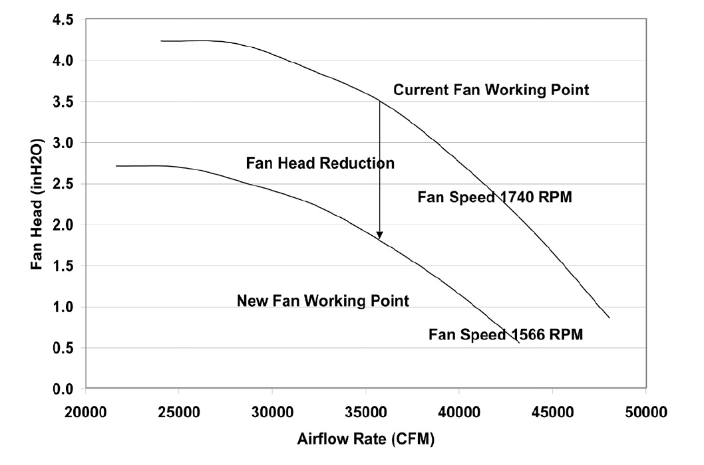

    Figure 4-1. Determining New Fan Speed Using Measured Fan Head Reduction and Fan Performance Curve

The airflow reduction can result in significant fan energy savings and reduced noise level. The following tips will help the implementation process:

* VFD or New Pulley: The fan speed can be changed by modifying the fan
  pulley or using a variable frequency drive. A VFD is generally recommended. The
  installation of a VFD allows further refinement of fan speed and slowing of the
  AHU during nights and weekends. The additional savings can generally offset
  the VFD cost within two years. In some cases, changing fan pulleys is more
  attractive because it avoids the VFD power loss and the cost is much lower.
* Air Circulation and Thermal Comfort: For hospitals and similar facilities, air
  flow must satisfy both air circulation and thermal comfort requirements. Make
  sure that any airflow reduction will not violate ventilation code requirements.
* Sequence of Implementation: Before reducing fan speed, existing mechanical
  problems should be addressed at the zone level. If a zone lacks air due to
  distribution problems such as a kinked flex duct or a damper stuck closed,
  solve these distribution problems first. After these air balance problems are
  solved at the zone level, the fan speed adjustment can be performed.
* Readjustment of Outside Air Flow: For most existing systems, the minimum out
  side air damper position should be adjusted after adjusting total air flow. Make
  sure that the minimum outside air intake satisfies IAQ requirements. See next
  section for details.

More information can be found in “Continuous CommissioningSM of a Hospital Complex” [Wei et al. 2001].

EXAMPLE:

The Materials Research Institute (MRI) Building in State College, Pa., has 50,000 square feet of floor area that includes offices, laboratories and classrooms.

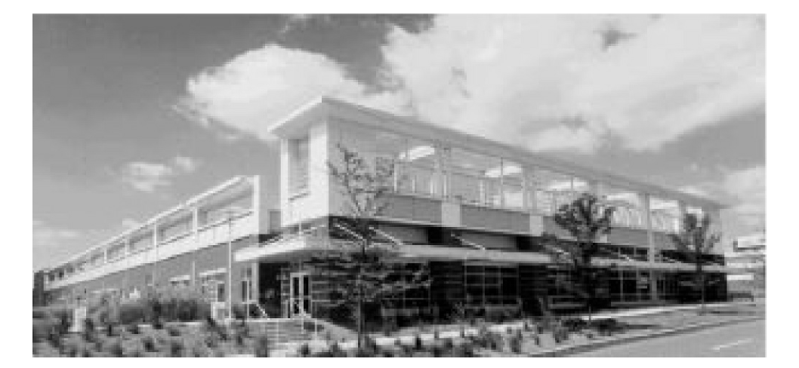

    Figure 4-2. The Materials Research Institute Building in State College, Pa.

There are three major AHUs in the building. AHU1 is a DDVAV unit with inlet guide vanes and supplies air to the offices in the building. AHU3 and AHU4 are 100% outside air dual duct constant volume units that supply air to the laboratory areas in the building.
The minimum static pressure was measured to be 2.68 in. H2O at the entrance to the last terminal box. Pulley sizes on AHU3 and AHU4 were reduced to lower the static pressure to approximately 1.0 in. H2O. A number of other measures were also implemented in the summer of 1998.

Figure 4-3 compares the monthly gas and electricity consumption before and after implementation of fan pulley changes and other CCSM measures in the MRI building. Utility bill analysis showed a 40% reduction in annual gas use with a cost savings of $52,382/yr. The annual electricity use was reduced by 12% with cost savings of $34,250/yr. The total annual cost savings were $86,632/yr, or 21% of the total utility cost.

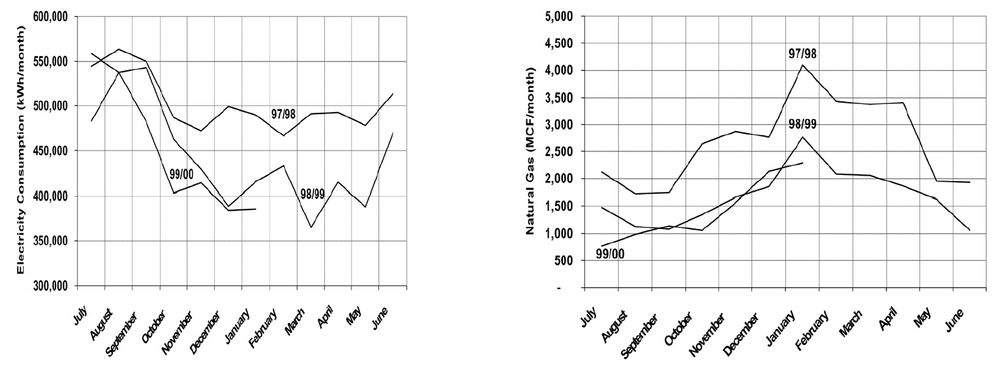

    Figure 4-3. Natural Gas and Electricity Consumption at the Materials Research Institute Before and After Implementation of CCSM Measures

4.2 正确设置最小新风量
----------------------------------------------

Outside air intake rates are often significantly higher than design values in existing buildings due to lack of accurate measurement, incorrect design calculation and balancing, and operation and maintenance problems. Excessive outside air intake isoften directly caused by one or more of the following:

* Mixed air chamber pressure is lower than the design value. For example,
  the static pressure often varies from –0.2 in. H2O to –1.0 in. H2O when the
  design assumed –0.1 in. H2O or higher.
* Significant outside air leakage through the maximum outside air damper on
  systems with an economizer. Due to the large size of this damper, the air
  leakage can be significant.
* Minimum outside air intake is set using minimum total air flow for a VAV
  system. For most existing systems, the minimum outside air damper position
  is set at a fixed position. When the total air flow is higher than the minimum
  system flow, the pressure in the mixed air chamber becomes more negative.
  Consequently, the outside air intake is higher than the minimum required when
  total air flow is higher than the minimum air flow.
* Lower than expected/designed occupancy. For example, the outside air intake
  is often determined based on space peak occupancy schedule. However, when
  a meeting is held in a conference room, several offices are not occupied. It is
  estimated that 10% or more of the occupants will not be present in their
  working place at any given time due to travel, meetings, vacations or sick
  leave. Hence the minimum outside air flow is often significantly over-
  designed.

The excessive outside air intake consumes a significant amount of extra heating and cooling energy. Each extra cfm of outside air intake typically costs from $1 to $3 per year depending on location and energy cost. If there is too much outside air, the AHU may lose the ability to control room humidity and temperature.

Excessive outside air intake can be identified by one of the following methods:

* Measure CO2 level of the return air for critical zones. For a typical office
  building under normal occupied conditions, the return air CO2 level should
  be 500 ppm to 600 ppm higher than the outside air CO2 level when minimum
  design outside air is used. If the CO2 level of return air increases by less than
  500 ppm under normal occupancy, it indicates excessive outside air intake.
  Do not apply this criterion during economizer cycle operation.
* Measure outside air intake and compare with the design value. If a section of
  straight ductwork carries the outside air, a direct flow measurement is
  recommended. The airflow measurement may also be performed using turbine
  flow sensors in the inlet of the outside air intake grilles. However, this
  measurement should be performed when wind speed is lower than 15 FPM.
* Measure air flow indirectly using temperature measurements. In most cases,
  the outside air intake goes directly or almost directly into the mixing chamber.
  Therefore, outside air flow is determined using measured total air flow and
  temperatures (mixed, outside and return):

    .. math::

        CFM_{oa} = CFM_t\frac{T_m - T_r}{T_{oa} - T_r}

This method can be used only when the temperature difference between return and outside air is greater than 10°F. To improve the measurement accuracy, one probe should be used to measure all temperatures. Be cautious about using control system sensors for these measurements. The typical measurement errors of control sensors are +1.5°F, which will, in many cases, significantly lower the accuracy of the outside air flow determined. The location of the sensors may also cause problems. The return air temperature sensor must be located on the discharge side of the return air fan. The mixed air temperature sensor must be located before the supply air fan. The temperature measurement methods must ensure true average temperature.

.. sidebar:: **Note**

    Be cautious about using control system sensors for these measurements. The typical measurement errors of control sensors are +1.5°F, which will, in many cases, significantly lower the accuracy of the measurement.

Minimum outside air control can be implemented using one of the following methods:

* For constant air volume systems, the minimum outside air intake should be
  adjusted using the outside air damper. After adjusting the outside air
  damper position, the air flow should be measured again to verify the flow. A
  seasonal inspection and adjustment is suggested since the air leakage through
  the maximum outside air dampers changes significantly after economizer
  operation.
* For VAV systems, the outside air damper position corresponding to correct
  minimum flow should be determined at both the minimum and the maximum
  total air flows. The minimum outside air damper position can be modulated
  between these two positions when the total air flow varies from the minimum
  to the maximum value.
* For VAV systems, where the minimum outside air damper is not controlled
  by an independent actuator, the following action can improve outside air
  control and minimize excessive thermal energy consumption associated with
  outside air intake:

    - Set the minimum outside air intake position when the building is normally
      occupied and the outdoor temperature is about 65°F
    - Reset static pressure to a lower value when the total air flow is lower than
      the design value. Decrease the static pressure from the design value to 50%
      of the design value as the total air flow decreases from 100% to 70%. For
      example, assume the design static pressure set point is 1.2 in. H2O at
      maximum air flow. When the AHU air flow is 70% of the design value,
      the static pressure would be reset to 0.6 in. H2O.

The minimum outside air requirement actually depends on both occupancy and building exhaust air flow. The outside air requirement decreases as the number of occupants decreases. However, the outside air intake must be slightly higher than the common exhaust air flow in order to maintain positive building pressure. Dynamically adjusting outside air intake based on the occupancy can result in significant building energy savings while maintaining satisfactory indoor air quality. The optimal outside air control (demand control) can be implemented using one of the following methods:

* Install CO2 sensor(s) to measure return air or representative zone CO2 level.
  Modulate the outside air damper to maintain the set point. When this method
  is used, a low limit must be set to make sure that the outside air intake is higher
  than the common exhaust air flow.
* Develop an outside air damper reset schedule based on the time of the day. The
  occupancy level has a strong correlation with the day of the week and the time
  of day. When occupancy information is available, a damper schedule can be
  developed and implemented using the building automation system.

EXAMPLE:

The Starr Building in Austin, Texas, is a typical older state government office building. It consists of a three-story section and a six-story section with a combined floor area of 99,000 ft2. The HVAC systems included two 175-ton hermetic centrifugal chillers, two 2.4 MMBtu/hr gas fired boilers and four multi-zone AHUs.

Due to excessive negative pressure in the mixed air chambers, the building outside air intake (79,950 cfm) was nine times higher than the required minimum outside air intake (9,000 cfm). Due to a number of control problems, the total air flow (140,700 cfm) was 25% higher than the design value (112,225 cfm) and 53% higher than the required value (92,130 cfm).

The excessive outside air and total air flows caused significant building comfort problems as well as substantial energy waste. Since 1985 the building had experienced garage air backflow into the building though AHUs, high room temperatures in numerous rooms, high relative humidity (up to 80%) during summer, cold rooms during winter, and high building positive pressure.

After adjusting both outside air flow and total air flow to the required level, the building comfort problems were solved. Significant energy savings were also achieved. Table 4-1 compares the measured room temperature, relative humidity, and CO2 level in 18 pre-selected rooms before and after outside air and total airflow reduction. After implementing airflow reduction, the building comfort was controlled properly. The maximum room relative humidity decreased from 69% to 55%. The building positive pressure decreased from 0.1 in. H2O to 0.02 in. H2O.

.. table:: Table 4-1. Comparison of Room Comfort Parameters Before and After CCSM Implementation
    :align: center

    ===========================   ==============    ==============
    Condition                      Before CC        After CC
    ===========================   ==============    ==============
    Room CO2 Level                 400 – 500 ppm    650 - 800 ppm
    Room Temperature               67 - 74.5 °F     72 – 75 °F
    Room Relative Humidity         58% - 69%        50% - 55%
    Building Positive Pressure     0.1 in. H2O      0.02 in. H2O
    ===========================   ==============    ============== 

Note: The ambient air temperature was 88°F on June 8, 1995 when the pre-CCSM test was performed. The ambient temperature was 99°F on June 14, 1996 when the post CCSM test was performed.

Figure 4-4 compares the measured monthly average hourly electricity consumption before and after the implementation of the CCSM measures. The simple linear regression model shown was created based on the measured data. When the ambient temperature was low, the post-CCSM electricity consumption was higher than that of the pre-CCSM period due to the reduced outside air flow. When the ambient temperature was high, the post CCSM electricity consumption was significantly lower than during the pre-CCSM period. The measured electricity demand savings were 90 kW when the ambient temperature was 85°F.

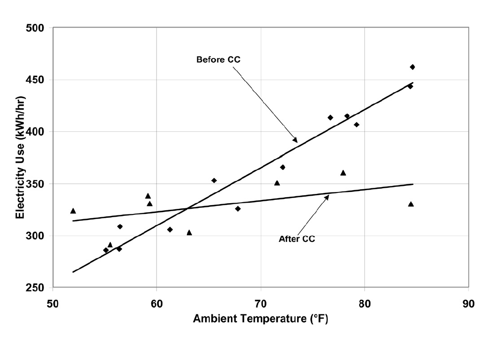

    Figure 4-4. Measured Monthly Average Hourly Whole Building Electricity Consumption Versus the Monthly Average Ambient Temperature

Figure 4-5 presents the measured monthly average hourly heating energy consumption versus the monthly average ambient temperature. Regression models of the data are also presented. The measured heating energy savings varied from 0.1 MMBtu/hr to 0.7 MMBtu/hr when the monthly average hourly temperature was between 75°F and 52°F. The measured gas savings varied from 0.12 MMBtu/hr to 0.88 MMBtu/hr when the monthly average hourly temperature varied from 75°F to 52°F.

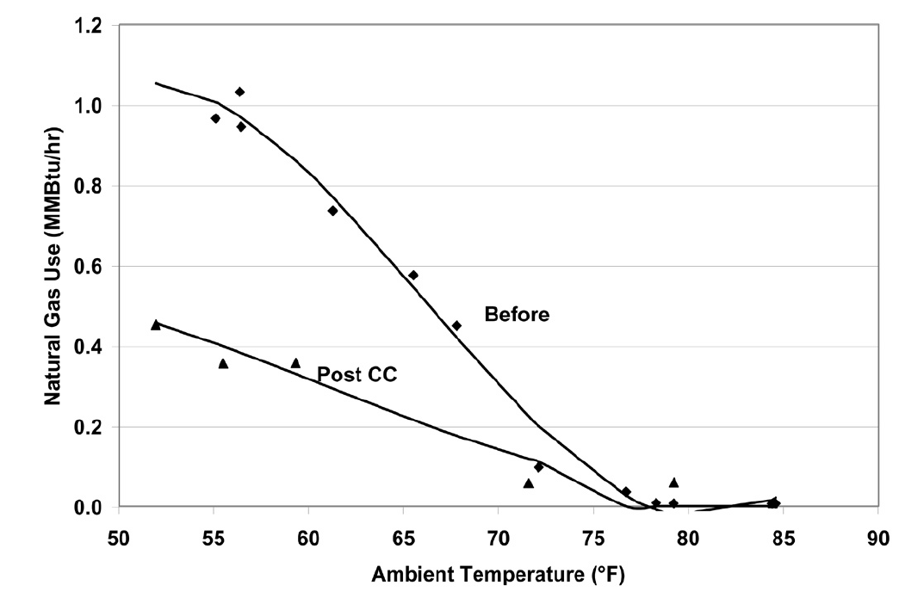

    Figure 4-5. Measured Heating Energy Consumption Versus the Monthly Average Hourly Ambient Temperature

The measured annual energy savings are 4,940 MMBtu/yr which includes 1,640 MMBtu/yr of electricity savings and 3,300 MMBtu/yr of gas savings. The annual energy use index decreased from 150,800 Btu/ft2/yr to 101,000 Btu/ft2/yr. More detailed information can be found in “An O&M Story in An Old Building” [Liu et al. 1996].

4.3 改善静亚设点值和运行时刻
--------------------------------------------------------

The supply air static pressure is often used to control fan speed and ensure adequate air flow to each zone. If the static pressure set point is lower than required, some zones may experience comfort problems due to lack of air flow. If the static pressure set point is too high, fan power will be excessive. In most existing terminal boxes, proportional controllers are used to maintain the airflow set point. When the static pressure is too high, the actual air flow is higher than its set point. The additional air flow depends on the setting of the control band. Field measurements have found that the excessive air flow can be as high as 20% [Liu et al. 1997b]. 

Excessive air flow can also occur when terminal box controllers are malfunctioning. For pressure dependent terminal boxes, high static pressure causes significant excessive air flow. Consequently, high static pressure often causes unnecessary heating and cooling energy consumption. A higher than necessary static pressure set point is also the primary reason for noise problems in buildings.

The static pressure set point is often determined under the maximum cooling load condition. The value may be determined by the design engineer using a theoretical calculation or a rule of thumb. The operating staff may increase the value to “eliminate” hot spots. The static pressure set point is often significantly higher than required. Accurately determining the maximum static pressure set point is critical for both thermal comfort and fan energy consumption [Zhu et al. 1998]. The maximum static pressure set point can be identified using the following procedures:

*   Determine the maximum static pressure requirement of the terminal box. Set
    the terminal box to full cooling. Modulate static pressure at the front of the
    terminal box using a balance damper or VFD. When the terminal box is 95%
    open, record the static pressure in front of the terminal box. This pressure is
    considered to be the maximum static pressure required for the terminal box.
    The measurement should be conducted for each type of terminal box if more
    than one type of terminal box is used.
*   Measure the duct pressure loss. Select the remote terminal box that has the
    lowest static pressure at the inlet of the terminal box. Measure the static
    pressure at the entrance of each remote terminal box. Pick the minimum static
    pressure value measured at a remote terminal box as the terminal box static
    pressure (pt). If there is more than one type of terminal box on a single AHU,
    determine the minimum remote box pressure for each box type and use the
    highest of these values as the terminal box static pressure (pt). Measure the
    static pressure (ps) at the location of the static pressure sensor. The pressure
    loss is defined as the difference between the static pressure at the static
    pressure sensor and the terminal box static pressure. Make sure all dampers are completely open between the static pressure sensor and the terminal box. Other flow blockages must be removed as well. Measure air flow through the AHU .
*   Determine the maximum static pressure set point. The following steps should be
    followed:

        -   Determine the airflow ratio (β) defined as the ratio of the measured air
            flow to the maximum air flow reached at the design condition by this
            AHU. Many AHUs never reach 100% design air flow, so do not assume
            the maximum flow is the design flow. It may only be 70% or 80% of
            the design flow.
        -   Calculate the maximum static pressure set point using the equation below
            based on the measured terminal box static pressure requirement (pt) and
            the duct pressure loss between the location of the static pressure sensor
            and the remote terminal box (ps-pt)

            .. math::
                
                p_{s,max} = p_t + \frac{1}{\beta ^2} \left(p_s - p_t \right)

The maximum static pressure determined by equation 4-3 will provide reliable system operation under both peak and partial load conditions. Under partial load conditions, the duct pressure losses are lower due to decreased airflow rate. If the maximum static pressure is used, the terminal box dampers must provide the pressure drop no longer occurring in the duct. This causes higher fan power than necessary and sometimes causes noise problems in the terminal box due to excessive pressure drop. Therefore, the static pressure set point should be decreased when the air flow decreases. This is called static pressure reset.

The static pressure set point, under partial load conditions, depends on a number of parameters such as the zone load distribution and duct layout. If all zones have the same load ratio, the static pressure set point under partial load is proportional to the square of the airflow ratio.

.. math::

    p_s = \beta ^2 p_{max}

If the zone load ratios are different, the static pressure set point should be higher than the set points given by equation 4-4. The accurate determination of the set point is a complex task. Generally, the following method can be used to determine the reset schedule.

*   Set the minimum static pressure based on the minimum air flow ratio
    (determined at the minimum flow setting in equation 4-5), the maximum static
    pressure value (ps,max) determined from equation 4-3, and the terminal box
    minimum static pressure requirement (pt). For example if the maximum static
    pressure, the minimum airflow ratio and the terminal box minimum static
    pressure are 1.2 in. H2O, 50% and 0.5 in. H2O respectively, the minimum static
    pressure is 0.43 in. H2O. It is assumed that the terminal box will require at least
    half of the minimum pressure requirement (pt) under partial air flow.

    .. math::

          p_{s,min} = 0.5 p_t + \beta_{min} ^2 \left( p_{s,max} - p_t \right)

*   Due to the uncertainty of the duct layout and the load diversity factor, it is
    recommended that the static pressure be reset linearly between ps,min and ps,max
    as a function of the air flow (cfm):

    .. math ::

          p_s = p_{s,min} + \frac{\dot{V} - \dot{V}_{min} }{\dot{V}_{max} - \dot{V}_{min} } \left(p_{s,max} - p_{s,min} \right)

When air flow is not measured, the VFD speed may be used to represent the airflow ratio. For example, if the VFD control command is 50 Hz, the fan speed is approximately 80% of its maximum speed. The air flow can be assumed to be 80% of the design flow. This is only an approximation due to changes in terminal box damper positions.

When modern control systems are installed on both the AHU and terminal boxes, the fan may be directly controlled by the damper positions in the terminal boxes. The fan speed control should maintain at least one selected terminal box at the maximum open position [Hartman 1989]. When all terminal boxes are functioning properly, this method uses the least fan power. However, when a terminal box is malfunctioning, this method may not produce the expected savings. For example, malfunctioning flow stations may force dampers to the full open position. The fan will run at full speed to satisfy the requirement of these malfunctioning sensors. Therefore, this control method should be integrated with a static pressure reset schedule [Wei et al. 2000] to minimize the fan energy. The fan speed is modulated to maintain one or more terminal dampers at full open position. If the static pressure is lower than the reset schedule set point, modulate the fan using the damper position. If the damper position signal modulates the static pressure to the reset schedule set point, use the reset schedule to prevent the static pressure from going higher.

.. sidebar:: **Note**

    The fan speed control should maintain at least one selected terminal box at the maximum open position [Hartman 1989]. When all terminal boxes are functioning properly, this method uses the least fan power.

EXAMPLE:

AHU-P2, serving the 11th floor of an M. D. Anderson Hospital facility in Houston, Texas, is a dual duct VAV system with design air flow of 19,650 cfm. A VFD is installed on the 40 hp. supply air fan. The static pressure was set at 2.5 in. H2O according to the design specifications in May 1997.

A static pressure reset schedule was developed and implemented during the building commissioning process [Liu et al. 1998a]. Figure 4-6 presents the reset schedules implemented and compares the measured values with the set points. The static pressure is reset according to the fan speed. When the VFD speed is less than 60%, the static pressure is set at 0.5 in. H2O. As the VFD speed increases from 60% to 90%, the static pressure set point increases from 0.5 in. H2O to 0.8 in. H2O. As the VFD speed increases from 90% to 100%, the static pressure set point increases from 0.8 in. H2O to 1.25 in. H2O. The measured static pressure set point closely follows the reset schedule.

When the VFD speed is less than 60%, the static pressure set point reduction is 2.0 in. H2O or 80% of the initial set point. As the VFD speed increases from 60% to 80%, the static pressure set point reduction decreases from 80% to 68%. The VFD speed is rarely higher than 90%. The static pressure reset saves about 68%-75% of the annual fan power.

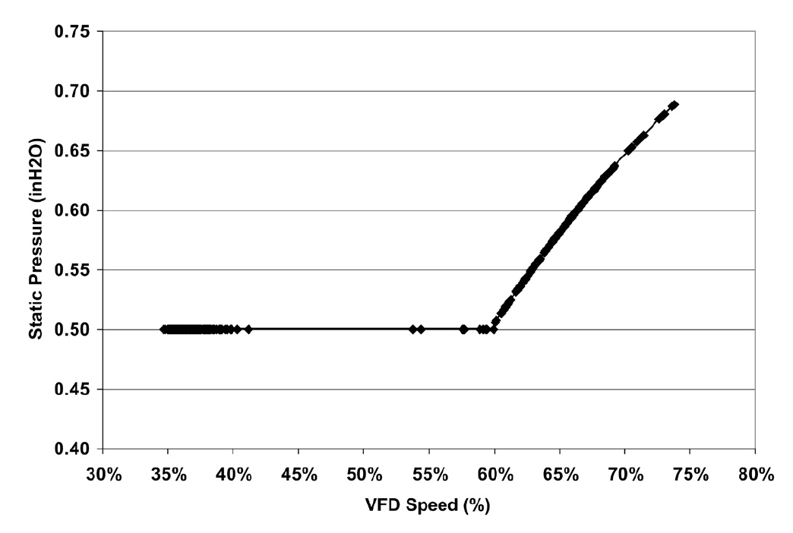

    Figure 4-6. Optimal Static Pressure Reset Schedule and Measured Static Pressure Versus the VFD Speed for AHU-P2 at the CSF Building, M.D. Anderson Cancer Center, Houston, Texas

4.4 优化送风温度
----------------------------------------

Supply air temperatures, cooling coil discharge air temperature for single duct systems or cold deck and hot deck temperatures for dual duct systems, are the most important operation and control parameters for AHUs. If the cold air supply temperature is too low, the AHU may remove excessive moisture during the summer using mechanical cooling. The terminal boxes must then warm the over-cooled air before sending it to each individual diffuser for a single duct AHU. More hot air is required in dual duct air handlers. The lower air temperature consumes more thermal energy in both systems. If the cold air supply temperature is too high, the building may lose comfort control. The fan must supply more air to the building during the cooling season; therefore fan power will be higher than necessary. The goal of optimal supply air temperature schedules is to minimize combined fan power and thermal energy consumption or cost. Although developing optimal reset schedules requires a comprehensive engineering analysis, improved, near optimal, schedules can be developed based on several simple rules. Guidelines for developing improved supply air temperature reset schedules are provided below for four major types of AHU systems.

For single duct, constant air volume systems, the following guidelines are recommended:

*   Maintain the supply air temperature no higher than 57°F if the outside air
    humidity ratio is higher than 0.009 or the dew point is higher than 55°F. This
    is required to properly control room humidity level. Both humidity ratio and
    dewpoint can be determined using dry bulb temperature and relative humiditydata. Most building automation systems can calculate humidity ratio and dewpoint temperature. The psychrometric chart can also be used to determine
    the humidity ratio and the dew point.
*   When outside air humidity ratio is lower than 0.009, the supply air temperature
    can be reset to a higher temperature using one of the following parameters:
    outside air temperature; minimum reheat valve position; or return air
    temperature.

    -   The supply air temperature is often linearly reset using outside air
        temperature. A reset schedule that may be used as a convenient starting
        point is
        ts = 65°F                           if toa < 30°F
        ts = [55 + 0.333(60 – toa)] °F      if 30°F < toa< 60°F
        ts = 55°F                           if toa > 60°F
        If you wish to determine a more aggressive reset schedule, the following
        procedure may be used.
        ts = Min ( 65°F, t1 – φ(toa,1 – toa)) when toa < toa,1
        ts = td when toa > toa,1
        td is the design supply temperature, typically 55°F. As noted, the supply
        temperature is maintained at this value when outside air temperature is
        high enough that humidity levels above approximately 0.009 are likely to
        occur.
        toa,1 is often selected as 55°F in humid climates and increases to 65°F in
        relatively dry climates. When outside air temperatures are below toa,1,
        supply air temperature reset to higher temperatures will not impact
        room humidity control.
        t1 is the supply air temperature set point determined by the sensible load at
        toa,1. The supply temperature begins to increase as toa decreases below toa,1
        until it reaches 65°F and is maintained at 65°F for lower outside air
        temperatures.
        A field measurement should be performed when the outside air tempera-
        ture is at toa,1 to determine the optimal supply air temperature t1. Under
        normal occupancy conditions, increase the supply air temperature
        gradually until at least one reheat valve is fully closed. This supply air
        temperature is t1.
        The same measurement can be performed to determine the optimal supply
        air temperature (t2) at an outside air temperature (toa,2) at least 10°F below
        (toa,1).
        The reset rate φ is then determined as:
        
        .. math::

            \phi = \frac{t_2 - t_1}{t_{oa,2} - t_{oa,1}}

        Note that φ, as defined in equation 4-9, will be negative. t1 is often sign-
        ificantly higher than 55°F and the control must be properly set to avoid
        unstable switching between t1 and td when the outside air temperature is
        near toa,1. When the outside air temperature is higher than toa,1, the supply
        air temperature is based on the need for dehumidification. When the
        outside air temperature is lower than toa,1, the supply air temperature is
        based on the sensible load. Resetting the supply air temperature to a higher
        value, such as t1, can reduce reheat without humidity control problems.

    -   The supply air temperature may be reset using the minimum reheat valve
        position. The supply air temperature should maintain at least one reheat
        valve in the closed position. If all reheat valves are open, the supply air
        temperature should be increased and vice versa. When this method is used,
        high and low limits should be used to prevent incorrect set points caused
        by a faulty control valve.
    -   The supply air temperature may also be reset using the return air temperature
        when all room temperatures are controlled and monitored by the central
        control system. If occupants can change room temperature set points, this
        method should be combined with the reset schedule defined above. This
        method can only be used when the outside air temperature is lower than
        60°F or another value of toa,1 is determined above to be a suitable starting
        temperature for increasing the supply temperature.

For single duct VAV systems, the following guidelines are recommended:

*   Maintain the air temperature no higher than 57°F if the outside air humidity
    ratio is higher than 0.009 or the dew point is higher than 55°F. Both humidity
    ratio and dew point can be determined using dry bulb temperature and relative
    humidity data. Most building automation systems can calculate humidity ratio
    and dew point temperature. The psychrometric chart can also be used to
    determine the humidity ratio and the dew point.
*   Maintain the supply air temperature no higher than 57°F if the fan air flow is
    higher than 70% of the air flow under the maximum load conditions. This is
    often significantly smaller than 70% of the design air flow. When the air flow
    is higher than 70%, increased air flow has a significant impact on fan power.
    For example, resetting the supply air temperature from 55°F to 57°F can
    potentially increase the air flow by 10%. This will increase fan power from
    34% to 51% of the maximum value.
*   When the outside air humidity ratio is lower than 0.009 and the air flow is
    lower than 50%, the supply air temperature can be modulated to maintain total
    airflow at 50% or lower. If the air flow is lower than 50%, the supply air
    temperature can be increased. However, the supply air temperature must be
    lower than a high limit, which can be set to 65°F. When static pressure reset is
    applied, the air flow ratio can be estimated using the supply air fan speed ratio.

More detailed information on these procedures can be found in “Optimize the Supply Air Temperature Reset Schedule for Single Duct VAV Systems” [Wei et al. 2000a].

For dual duct constant air volume systems, the following guidelines are recommended:

When the mixed air temperature is lower than the cold deck set point, set the
hot deck temperature based on zone comfort requirements. Set the cold deck
temperature at the mixed air temperature. In theory, the hot deck set point has
no impact on thermal energy consumption. However, a higher hot deck
temperature may cause higher thermal energy consumption due to hot air
leakage in interior zone terminal boxes. Therefore, the hot deck temperature
should be set as low as possible provided the room comfort is maintained
properly.

* When the mixed air temperature is higher than the hot deck temperature set
  point or the heating coil is shut off, set the cold deck temperature at the design
  value (55°F). Resetting the cold deck temperature higher does not reduce
  cooling energy consumption.
* When the mixed air temperature is between the cold and hot deck temperature
  set points, the reset should narrow the difference between the cold and hot deck temperatures. The closer the cold and hot deck temperatures, the lower the
  thermal energy consumption. However, setting the hot deck too low or the cold
  deck too high can cause building comfort problems. Therefore, the following
  suggestions are given:

  - Reset the cold deck temperature using the same procedure as used for the
    constant air volume single duct system:
    ts = Min ( 65°F, t1 – φ(toa,1 – toa)) when toa < toa,1
    ts = td when toa > toa,1
    provided the mixed air temperature, tma, is greater than ts .
    t1 is the supply air temperature set point determined by sensible load when
    the outside air temperature is toa,1. toa,1 is often selected as 55°F for humid
    climates and increases to 65°F for relatively dry climates. The field
    measurement that determines t1 is slightly different from that for the single
    duct system. Under normal occupancy conditions, increase cold deck
    temperature gradually until at least one hot air damper is fully closed.
    The cold air temperature is now at t1. The same measurement can be
    performed to determine the optimal supply air temperature (t2) at
    another outside air temperature (toa,2) at least 10°F below (toa,1).
    The reset rate is then determined as:
    It is recommended that the discussion for the single duct system be read
    before implementing this schedule for a dual duct system. It contains
    additional detail that may be helpful.

  - The cold deck supply air temperature may be reset using the maximum
    cold air damper position of the terminal boxes. If the maximum cold air
    damper position is less than 100% open, the cold deck temperature should
    be increased and vice versa. The cold air temperature should be limited to
    less than 65°F. This method can only be used when the outside air
    temperature is lower than t1 described above. 
  - Reset the hot deck temperature based on outside air temperature. The hot
    deck temperature should not be higher than 75°F when the outside air
    temperature is 70°F or higher. The supply air temperature should be
    determined through testing under typical local winter conditions. Under
    typical local winter conditions, adjust the hot deck temperature until the
    supply air temperature of one zone approaches within 2°F of the hot air
    temperature (th,max). The hot deck temperature should be reset linearly
    between 75°F and th,max as the outside air temperature decreases from 70°F
    to typical local winter conditions.

* For dual duct variable air volume systems, the cold and hot deck resets should
  consider both thermal and fan power. The optimal temperature reset schedules
  should minimize total air flow when the building cooling load or heating load
  requires more than the minimum airflow ratio. When minimum air flow is
  reached under low load conditions, hot air mixes with cold air to satisfy the
  minimum airflow requirement. To minimize thermal energy consumption, the
  difference between the cold and hot deck temperatures should be minimized.

The following guidelines are recommended for dual duct VAV systems:

* When the outside air temperature is higher than approximately 70°F, set the
  cold deck temperature at the design value (55°F) and shut off the hot deck
  control valve. Since the building has significant cooling load, this cold deck
  temperature set point will decrease the total air flow and save fan power.
* When the outside air temperature is lower than 70°F but higher than 55°F, set
  the cold deck temperature at 55°F and set the hot deck temperature in a range of
  75°F to 80°F.
* When the outside air temperature is lower than 55°F, reset the cold and hot
  deck temperature to keep at least one hot damper and one cold damper fully open.
  If the damper positions are not available, the reset schedule for the dual duct
  constant air volume system can be used.

More information can be found in “The Maximum Potential Energy Savings from Optimizing Cold and Hot Deck Reset Schedules for Dual Duct VAV Systems [Liu and Claridge 1999], “Impacts of Optimized Cold and Hot Deck Reset Schedule On Dual Duct VAV Systems-Theory and Model Simulation” [Liu and Claridge, 1998], “Impacts of Optimized Cold and Hot Deck Reset Schedule On Dual Duct VAV Systems-Application and Results” [Liu et al. 1998b] and “Reducing Building Energy Cost Using Optimized Operation Strategies for Constant Air Volume Systems” [Liu et al. 1995].

EXAMPLE:

Optimal cold and hot deck reset schedules were implemented in a major engineering education building with 324,400 square feet of gross floor area located on the Texas A&M Campus in College Station, Texas. The building houses classrooms, laboratories, computer facilities and offices. There are also clean rooms for solid state electronics studies. The building is open 24 hours per day and all AHUs operate 24 hours daily to satisfy fume hoods, late-night studying, research activities and computer facility operations.
There are 12 dual-duct variable air volume systems, each with a single supply air fan (12-40 hp.) installed in the basement to serve about 90% of the total building floor area. These 12 AHUs are spaced uniformly around the exterior wall. Each AHU has two risers from the basement to the third floor and serves approximately the same amount of area on each floor.

The building has a total of 384 terminal boxes. The zone load varies significantly from zone to zone due to occupancy, usage and exterior envelope load. Some of the terminal boxes serve only interior space. The total maximum air flow was determined to be 240,789 cfm, or 1.00 cfm/ft2, for the net usable floor area. The minimum airflow ratio varied from 0.3 to 0.7 with an average of 0.4.

The building used a constant cold deck temperature set point, even though it varied from 52°F to 55°F from one AHU to another. The hot deck set point varied from 110°F to 80°F as the outside air temperature increased from 40°F to 65°F.

.. sidebar:: **note**

    When the ambient temperature is higher than 70°F, the set point of each hot deck will force the hot water valve closed and the hot deck temperature will be at the mixed air temperature. Generally speaking, the building needs cooling when the outside air temperature is higher than 60°F. Therefore, the hot deck temperature at 70°F will not cause cold complaints.

The improved cold and hot reset schedules were determined using a calibrated simulation model [Liu et al. 1998b]. The improved cold deck temperature varies from 60°F to 54°F as the ambient temperature increases from 55°F to 90°F. The set point of the hot deck varies from 90°F to 70°F as the ambient temperature increases from 55°F to 70°F. When the ambient temperature is higher than 70°F, the set point of each hot deck will force the hot water valve closed and the hot deck temperature will be at the mixed air temperature. 

Generally speaking, the building needs cooling when the outside air temperature is higher than 60°F. Therefore, the hot deck temperature at 70°F will not cause cold complaints. When a cold complaint occurs, it often indicates a malfunctioning terminal box, such as a cold air damper stuck open. The hot air temperature set point is often determined by a single zone, such as a corner office with many windows. Other CCSM measures were also implemented in this building, but the reset schedules had the greatest impact on energy use.

Figure 4-7 compares the measured daily average chilled water energy consumption. Before the implementation of the improved reset schedules, the measured daily average chilled water consumption (per hour) varied from 2.4 to 7.5 MMBtu/hr. After implementation of the improved reset schedule, the measured hourly daily average chilled water energy consumption varied from 0.9 to 7.5 MMBtu/hr. Simultaneous heating and cooling has been reduced significantly when the daily average temperature is lower than 75°F.

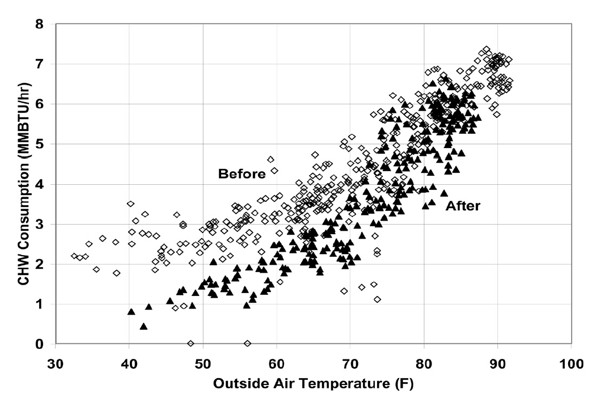

    Figure 4-7. Comparison of Measured Daily Average Chilled Water Consumption Before and After Implementation of the Optimal Hot and Cold Deck Temperature Reset Schedules

4.5 改善节能器运行和控制
---------------------------------------------

An economizer is designed to eliminate mechanical cooling when the outside air temperature is lower than the supply air temperature set point and decrease mechanical cooling when the outside air temperature is between the cold deck temperature and a high temperature limit or return air conditions, typically less than 70°F. An economizer should control the supply-air temperature by modulating the o/a damper when the o/a temperature is lower than supply-air temperature set point. However, economizer control is often implemented to maintain mixed air temperature at 55°F. This control algorithm is far from optimum. It may, in fact, actually increase the building energy consumption. Economizer operation can be improved using the following steps:

* Integrate economizer control with optimal cold deck temperature reset. It is
  tempting to ignore cold deck reset when the economizer is operating, because
  the cooling is free. However, cold deck reset normally saves significant heating.
* For a draw-through AHU, set the mixed air temperature 1°F lower than the
  cold deck temperature set point. For a blow-through unit, set the mixed air
  temperature at least 2°F lower than the supply air temperature set point. This
  will eliminate chilled water valve hunting and unnecessary mechanical cooling.
* For a dual duct AHU, the economizer should be disabled if the hot air flow is
  higher than the cold air flow because the heating energy penalty is then typically
  higher than cooling energy savings.
* Set the economizer operating range as wide as possible. For dry climates, the
  economizer should be activated when the outside air temperature is between
  30°F and 75°F, between 30°F and 65°F for normal climates and between 30°F
  and 60°F for humid climates. When proper return and outside air mixing can
  be achieved, the economizer can be activated even when the outside air
  temperature is below 30°F.
* Measure the true mixed air temperature. Most mixing chambers do not achieve
  complete mixing of the return air and outside air before reaching the cooling
  coil. It is particularly important that mixed air temperature be measured
  accurately when an economizer is used. An averaging temperature sensor
  should be used for the mixed air temperature measurement.
* Use the economizer to directly control supply air temperature when the outside
  air temperature is lower than the cold deck set point. The chilled water valve
  should be closed to avoid damper and valve fighting. The mixed air chamber
  pressure should also be monitored to prevent freezing.

More detailed information on economizer control and optimization can be found in “Economizer Application in Dual-Duct Air Handling Units” [Joo and Liu 2002].

EXAMPLE #1:

Economizers were set to control mixed air temperature at 55°F for a major university, located in central Pennsylvania, with approximately 20 million square feet of floor area. Observations and field measurement indicated that, on average, none of the zones required the 55°F air supplied by the economizer to handle the internal gains when the outdoor temperatures were below 55°F. Thus, it was suggested that the mixed air temperature set point be increased to 60°F during the fall, winter and spring months, which our testing indicated was the lowest required supply air temperature under those conditions. It was recommended that the cold deck temperature be reset to the mixed air temperature. This change eliminated the need for the zone terminal units to reheat the air from 55°F to 60°F during these months, essentially saving 5°F of reheat for all hours that the system operated during these months. The savings were estimated to be 490,000 MMBtu/yr (20 million ft2×7 month/yr × 30 day/month × 24 hr/day × 0.9 cfm/ft2 × 60 min/hr × 5°F × 0.24 Btu/lbm.°F × 0.075 lbm/ft3). At a heating energy cost of $5/MMBtu to the end user, the annual energy cost reduction was estimated to be $2,450,000/yr.

EXAMPLE #2:

The Nursing Building, located in Austin, Texas, is a five story building with 95,000 square feet of floor area. It includes nursing classrooms, lecture halls, workshops, lounges and faculty offices. In 1991, VFDs were installed in two dual-duct AHUs (100 hp. each). Terminal boxes were converted into VAV boxes. As part of the retrofit, economizers were installed as well. During the winter of 1991/1992, the fan power was five times higher than the summer fan power consumption. The HVAC systems were unable to maintain the room temperature set point in many rooms.

In the winter of 1992/1993, the steam pressure was increased and the steam supply pipe was enlarged. The same problems continued with $2,000 of additional energy cost. Prior to performing CCSM, a field inspection and engineering analysis found that the hot deck air flow was three times the cold deck air flow. The recommendation was to disable the economizer. In the winter of 1993-94, two economizers were disabled. The fan power was kept below 40 kW. Steam consumption was decreased. The chilled water consumption increased slightly. The comfort problems disappeared. The annual energy cost savings were measured to be $7,000/yr.

Figures 4-8, 4-9 and 4-10 present the hourly fan power, heating and cooling energy consumption from August 1991 to March 1994. More detailed information can be found in “An Advanced Economizer Controller for Dual Duct Air Handling Systems with a Case Study” [Liu et al. 1997a].

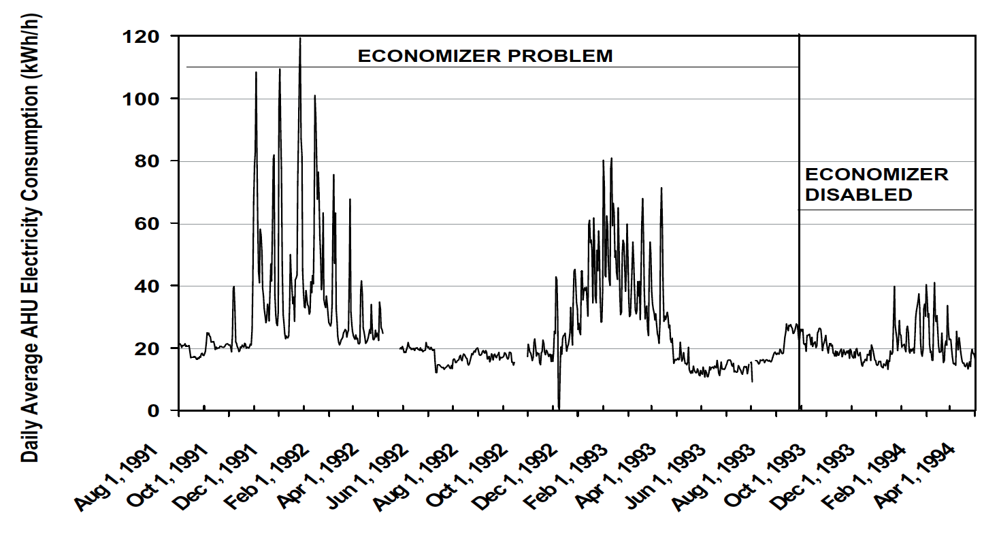

    Figure 4-8. Measured Hourly Fan Power for the Nursing Building in Austin, Texas

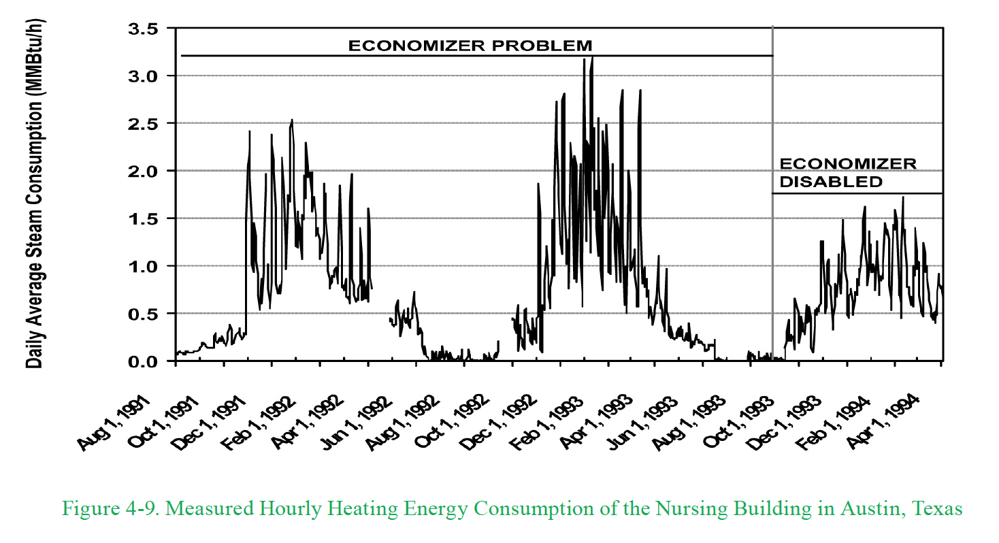

    Figure 4-9. Measured Hourly Heating Energy Consumption of the Nursing Building in Austin, Texas   

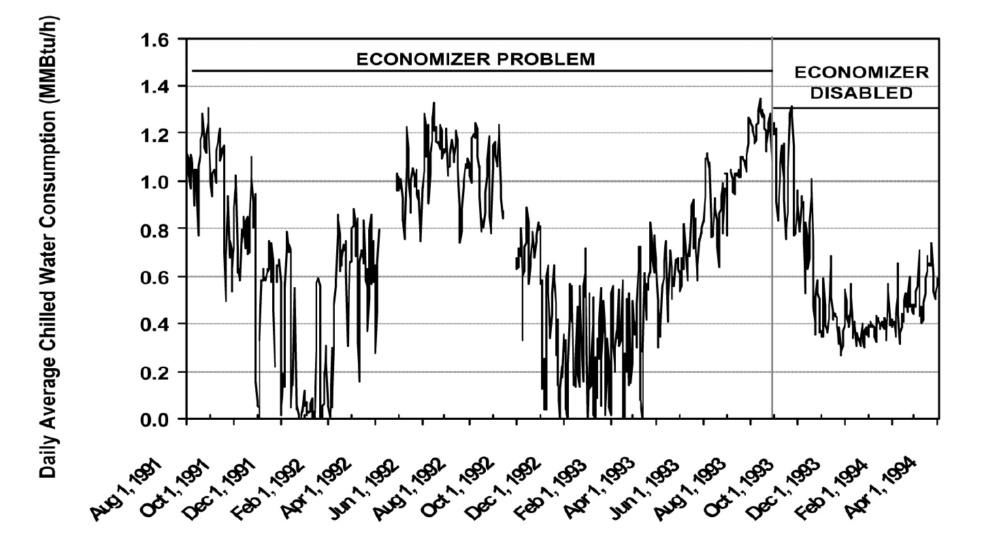

    Figure 4-10. Measured Hourly Cooling Energy Consumption of the Nursing Building in Austin Texas

4.6 改善AHU运行耦合控制
-------------------------------------------------

.. sidebar:: **Note**

    To control room relative humidity level, the control signals or spring ranges are overlapped. Simultaneous heating and cooling occurs almost all the time.

Coupled control is often used in single zone single duct, constant volume systems. Figure 4-11 presents the schematic diagram of a typical system. Conceptually, this system provides cooling or heating, as needed, to maintain the set point temperature in the zone. It uses simultaneous heating and cooling only when the humidistat indicates that additional cooling, followed by reheat, is needed to provide humidity control. However, the humidistat is often disabled for a number of reasons. To control room relative humidity level, overlap the control signals or spring ranges (See Figure 4-12). Simultaneous heating and cooling occurs almost all the time. Liu and Wang discuss the detailed optimization of this system [2001]. The key elements are listed below:

*   Locate the humidistat in an appropriate position. Avoid placing it above the
    ceiling or near a bathroom. Due to the local humidity environment, the
    humidistat often calls for full cooling even when the room relative humidity
    level is low.
*   Set the humidity level properly. Most humidistats have three set points: low,
    medium and high. For commercial building applications, the low level should
    be avoided except in dry or heating dominated climates. The low setting is
    equivalent to 30% room relative humidity. It is impossible to reach this value in
    humid climates even when the cooling valve is full open.
*   If the humidistat is disabled, repair is recommended. After the humidistat is
    repaired, a dead band (2 psi) should be set between actuation of the hot water
    and chilled water control valves for humid climates. For dry climates, the dead
    band is not necessary.
*   If a humidistat cannot be installed, the overlap should be less than 20% of the
    valve spring range. The following water side management measures should be
    implemented:

    - Manually valve off heating water during the summer if heating water is
      supplied to the building. This will eliminate simultaneous heating and
      cooling.
    - Manually valve off chilled water during the winter if chilled water is
      supplied to the building. This will eliminate simultaneous heating and
      cooling.
    - Maintain stable differential pressure across the control valves under partial
      load conditions. Reset loop differential pressure based on chilled water or
      hot water flow rate (see Chapter 5 “CCSM Measures for Distribution
      Systems” for details). Excessive differential pressures in the water loops
      can increase heating and cooling energy consumption by as much as 20%.
    - Separate chilled water and hot water valve control signals. This often
      requires an added control point in the control system. Force the chilled
      water valve closed during the heating season. Force the hot water valve
      closed during the cooling season.

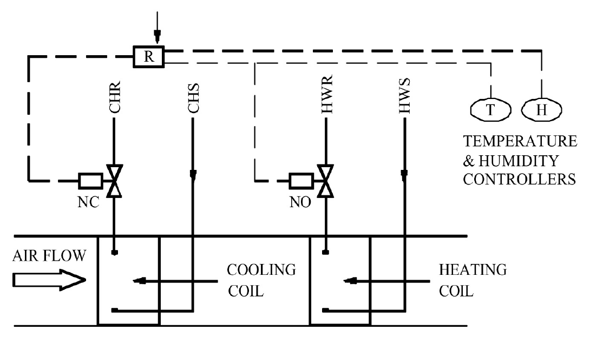

    Figure 4-11. Schematic Diagram of a Coupled Control System

    
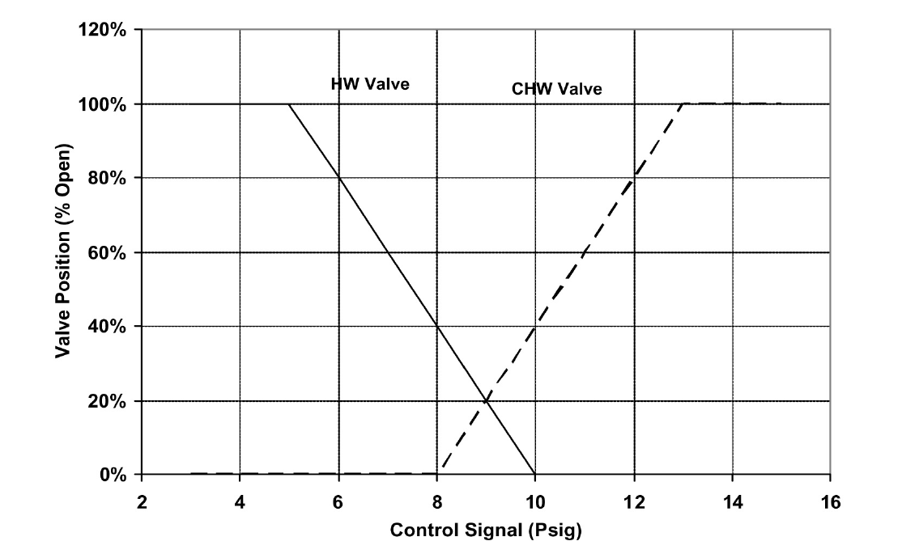

    Figure 4-12. Typical Valve Overlap for a Coupled Control System

EXAMPLE:

The Memorial Student Center, located in College Station, Texas, is a multi-purpose facility with 368,935 sq.ft. of space on three floors. The space includes cafeterias, banquet facilities, a bookstore, student activity rooms, meeting rooms, hotel rooms, a bowling alley, game rooms, an art gallery and other facilities. The first section of the building was built in the 1960s with additions over the next 30 years. It has 40 AHUs, a majority of which are coupled control units.

The building had comfort problems in a dozen areas. After solving these problems through air balance and other measures, the following measures were implemented in the coupled control AHUs:

* Chilled water loop differential pressure was reset based on water flow rate.
  The chilled water loop differential pressure was decreased from 30 psi to a
  range of 6.5 psi to 15 psi.
* Hot water temperature was reset from 180°F to 140°F since a VFD was not
  installed on the hot water loop
* Overlaps of the spring ranges were adjusted and calibrated to 20%
* High selector pneumatic thermostat settings were enabled for several
  multi-zone reheat AHUs

Figure 4-13 compares the measured hourly chilled water energy consumption before and after commissioning. The cooling energy consumption is plotted as a function of ambient temperature. The consumption for approximately four months prior to implementation of the CCSM measures is shown in the open rectangles while the consumption after implementation of the CCSM measures is shown in the open triangles. Cooling consumption was reduced by approximately 32% at the same time that comfort in the building was substantially improved. Figure 4-14 is a similar plot of heating consumption and shows a 27% reduction in heating after the CCSM measures were implemented.

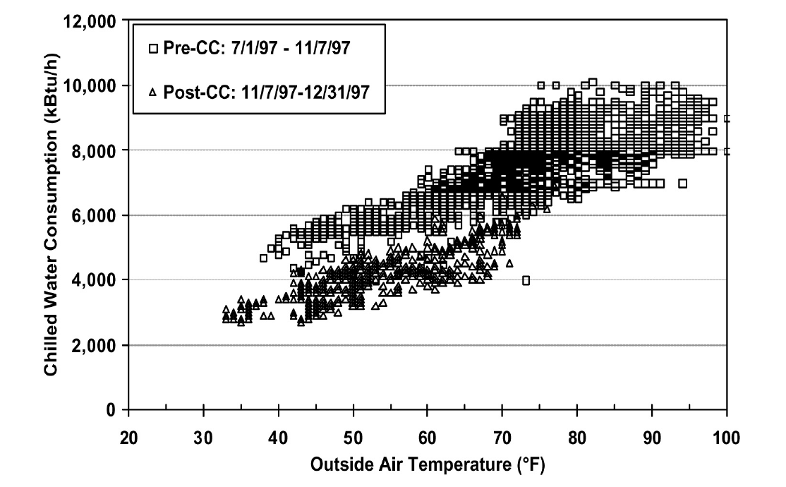

    Figure 4-13. Comparison of Chilled Water Energy Consumption Before and After Implementation of CCSM Measures

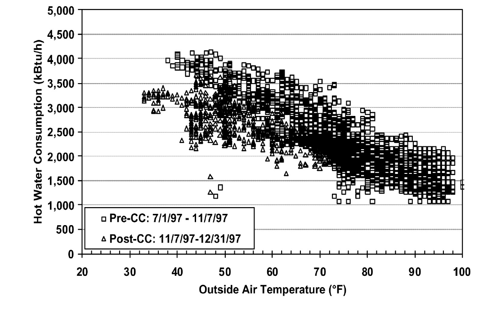

    Figure 4-14. Comparison of Hot Water Energy Consumption Before and After Implementation of CCSM Measures

4.7 夏季双风道AHU关闭热风阀门
-----------------------------------------------------------------

During the summer, most commercial buildings do not need heating. Theoretically, hot air should be zero for dual duct VAV systems. However, hot air leakage through terminal boxes is often significant due to excessive static pressure on the hot air damper. For constant air volume systems, hot air flow is often up to 30% of the total air flow. During summer months, hot air temperatures as high as 140°F have been observed due to hot water leakage through valves [Liu et al. 1998b]. The excessively high hot air temperature often causes hot complaints in some locations. Eliminating this hot air flow can improve building thermal comfort, reduce fan power, cooling consumption and heating consumption [Liu and Claridge 1999]. This measure should be implemented using one of the following methods:

* Use an automatic hot air damper for single fan systems. The procedures below
  should be followed:

    - Install an automatic hot air damper on the main hot air duct
    - Identify the minimum outside air temperature at which heating is not
      required. Operating staff can start with 70°F and refine as necessary.

If the outside air temperature is 3°F higher than the minimum value identified above, close the hot air damper. If the outside air temperature is 3°F below the minimum value, open the automatic damper. It is important to set the damper cycle time properly to maintain control stability. A two-minute cycle time is suggested. On large systems with significant air flows, significant damage can occur if the dampers are closed or opened too quickly. Figure 4-15 illustrates pressure rise vs. time. The static pressure can be as high as 13 in. H2O, which is high enough to damage the ductwork.

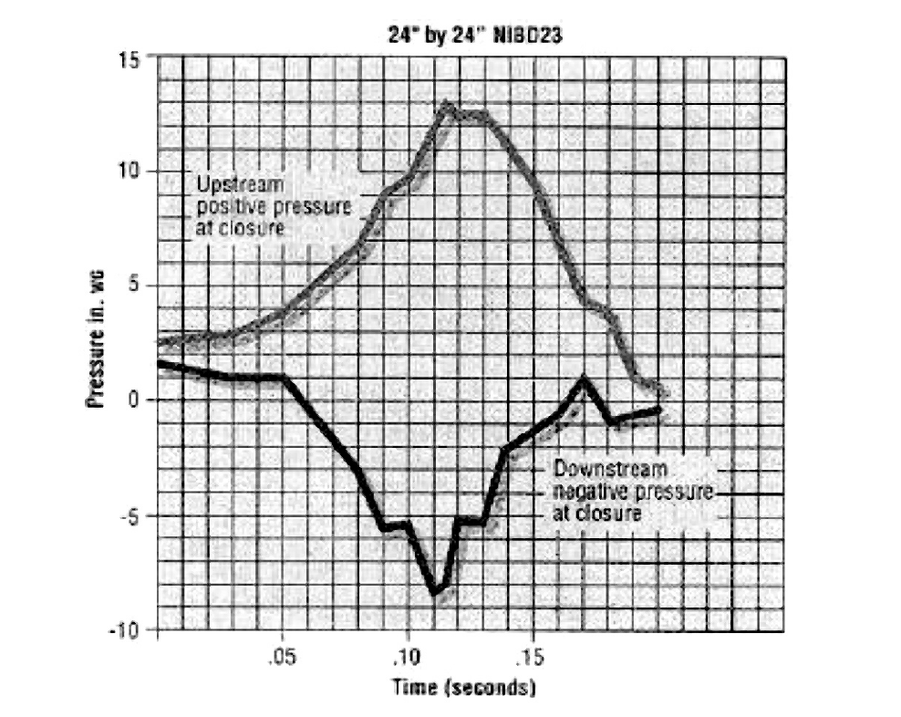

    Figure 4-15. Static Pressure Versus Time Upstream and Downstream of a Fire Damper When Suddenly Closed

* Use existing fire dampers for single fan systems

    - Identify the summer period, during which heating is not needed
    - Manually valve off fire dampers on the hot air duct at the beginning of the
      summer period
    - Manually open the fire dampers on the hot air duct at the end of the
      summer period. The procedures should be documented properly so they
      can be integrated as part of the NFPA bi-yearly fire damper inspection.
    - The fire damper control may also be performed automatically with
      minimal effort or cost. However, the fire damper must be checked to
      ensure it functions properly in case of emergency.

* Use a VFD on hot air fans for dual fan systems

    - Identify the minimum outside air temperature when heating is not
      required. Operating staff can start with 70°F and refine as necessary.
    - If the outside air temperature is 3°F higher than the minimum value
      identified above, turn off the hot air fan and close the discharge air
      damper of the hot air fan. If the outside air temperature is 3°F below
      the minimum value, turn on the hot air fan. It is important to set the
      damper cycle time properly to maintain control stability. A two-minute
      cycle time is suggested. A field inspection must be conducted to ensure
      that the air backflow through the fan does not drive the fan to run
      backward. If this occurs, either DC braking or a damper with better seals
      should be used to prevent the fan from turning backward. The backward
      motion of the fan could damage the VFD during the start-up process.

EXAMPLE:

The James E. Rudder building, in Austin, Texas, is a five-story office building with a total floor area of 170,000 sq.ft. It has two 75 hp. cold air fans on VFDs with a 50 hp. hot air fan without a VFD. Two computer rooms and a print shop are conditioned by separate AHUs. Constant volume terminal boxes are used in the building.

Prior to CCSM, the cold air static pressure was controlled at 2.5 in. H2O while the hot air static pressure varied from 2 in. H2O to 3.5 in. H2O, depending on the building heating load. The cold deck discharge air temperature was controlled at 52°F. The hot deck discharge air temperature varied from 90°F to 120°F as the outside air temperature varied from 80°F to 40°F. The average building temperature was approximately 75°F. Operating staff frequently received hot complaints during the summer months.

The following changes were recommended after a CCSM field visit and engineering analysis. A VFD was installed on the hot air fan. During the summer months (April 1 to October 3), the hot air fan and the hot air damper were shut off. The cold air fan maintained the cold air static pressure at 1.2 in. H2O. The cold deck temperature was maintained in the range from 55°F to 58°F.

During the winter months (November 1 to March 31), the hot air damper was open and the hot air fan was turned on to maintain a static pressure of 0.7 in. H2O in the hot air duct. The cold air static pressure was reset to 1.0 in. H2O. The cold deck discharge air temperature was reset in the range from 58°F to 60°F. The hot deck discharge air temperature was reset from 75°F to 95°F as the outside air temperature varied from 60°F to 30°F.

After implementing the control schedules described, hot and cold complaints were significantly reduced. The AHU system maintained room temperature set points well; they vary from 70°F to 76°F, depending on occupants’ preferences. The average building temperature decreased from 75°F to 73°F. The building relative humidity level was maintained between 50% and 58% during summer months.

Figures 4-16, 4-17 and 4-18 present the measured energy use for fans, heating and cooling, respectively. The pre-conversion period was from June 15, 1995, to June 14, 1996. The post-conversion period was from June 15, 1996, to June 14, 1997.

Before implementing CCSM measures, the daily average fan power varied from 90 kW to 125 kW. After implementing CCSM measures, the daily average fan power varied from 20 kW to 85 kW. The average measured fan power savings were 56 kW or 53% of the average pre-conversion fan power.

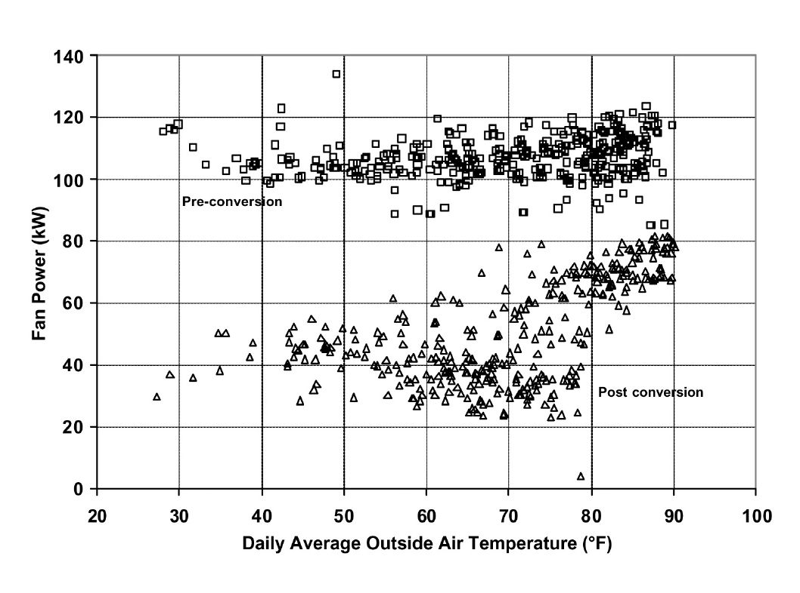

    Figure 4-16. Measured Fan Power Before and After Implementing the CCSM Measures

Figure 4-17 shows the measured daily average chilled water consumption. Before implementing the CCSM measures, the daily average chilled water consumption varied from 1.2 MMBtu/hr to 3.0 MMBtu/hr as the outside air temperature varied from 40°F to 90°F. Since implementing the CCSM measures, the daily average chilled water consumption has been reduced to a range of 0.3 MMBtu/hr to 2.0 MMBtu/hr. The measured daily average chilled water savings have averaged 0.68 MMBtu/hr or 36% of the daily average consumption (1.85 MMBtu/hr).

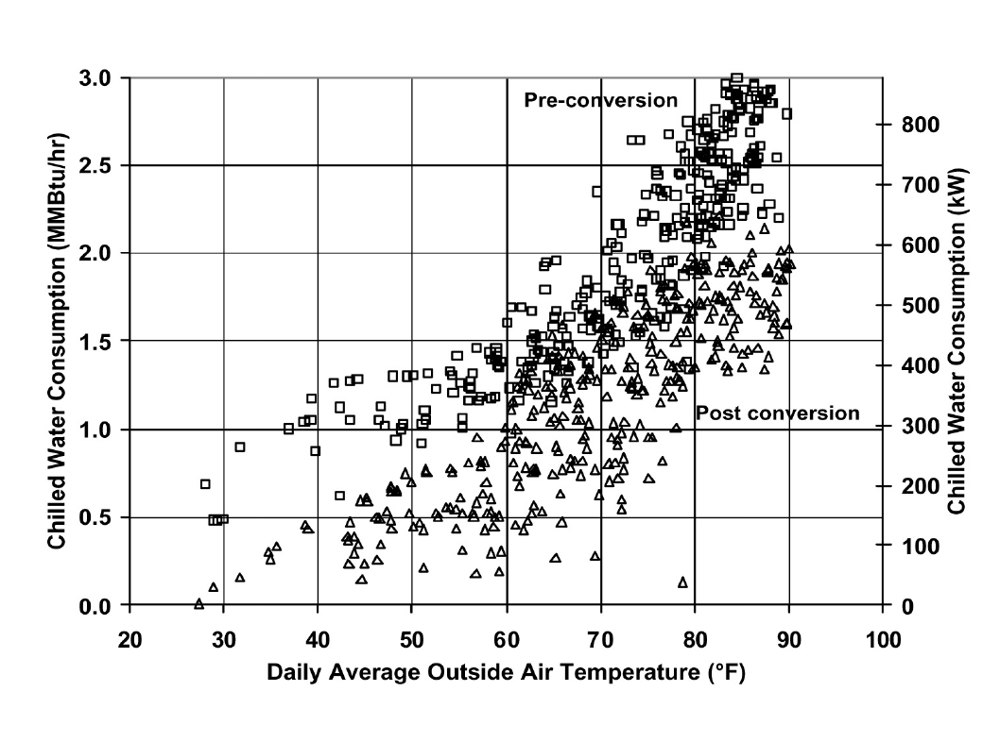

    Figure 4-17. Measured Chilled Water Consumption Versus the Daily Average Outside Air Temperature

Figure 4-18 shows a similar plot of the measured daily average hot water consumption. Before implementing the CCSM measures, the measured daily average hot water consumption varied from 0.8 MMBtu/hr to 1.8 MMBtu/hr as the outside air temperature varied from 40°F to 90°F. Since implementing the CCSM measures, the daily average hot water consumption has been reduced to the range from 0.1 MMBtu/hr to 1.5 MMBtu/hr. The measured daily average hot water savings are 0.56 MMBtu/hr or 45% of the pre-CCSM consumption.

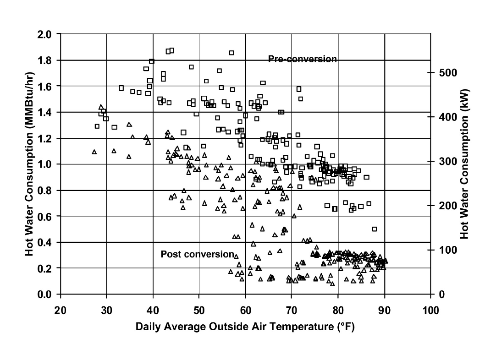

    Figure 4-18. Measured Hot Water Consumption Versus the Daily Average Outside Air Temperature

Table 4-2 summarizes the measured annual energy savings. The measured cost savings are $62,550/yr which includes $19,200/yr for chilled water, $18,670/yr for hot water and $24,680 for electricity.

.. table:: Table 4-2. Summary of Measured Annual Energy Savings

    ==============  ========  ======  ==============  ==========  ============== 
    Item            MMBtu     MWh     Demand(kW/Mon)  Cost($/yr)  Percentage(%)
    ==============  ========  ======  ==============  ==========  ==============  
    Chilled Water   5,910     1,730    --              $19,200      36%
    Hot Water       4,862     1,430    --              $18,670      45%
    Fan Power       1,694     497      60             $24,680      53%
    **Total**       12,466    3,657    60             $62,550      41%
    ==============  ========  ======  ==============  ==========  ==============

Note: Energy prices for electricity: $0.03470/kWh, $10.32/kW; chilled water price: $3.25/MMBtu; and hot water price: $3.84/MMBtu

4.8 定风量系统安装VFD
------------------------------------------------------

The building heating load and cooling load varies significantly with weather and internal occupancy conditions. In constant air volume systems, a significant amount of energy is consumed unnecessarily due to humidity control requirements. Most of this energy waste can be avoided by simply installing a VFD on the fan without a major retrofit effort. Guidelines for VFD installation are presented separately for dual duct, multi-zone and single duct systems.

* For a single fan dual duct constant air volume system, a VFD and two static
  pressure sensors should be installed

    -   During normal operating hours, the fan speed should maintain the static
        pressure set point in both ducts. When the building thermal load is less
        than the design value, both ducts carry air flow. The pressure loss through
        the main duct is significantly less than the design value. The use of a VFD
        can avoid having this reduced duct loss show up as additional pressure
        loss at the terminal boxes, thus saving fan power. More importantly,
        over-pressurization of the terminal box dampers with accompanying
        leakage is significantly decreased. Noise problems may also decrease
        significantly.
    -   During weekends or at night, flow can easily be reduced using the VFD.
        Compared with running the fan at full speed, this saves significant
        amounts of fan power, heating energy and cooling energy. More
        information can be found in “Variable Speed Drive Application in
        Dual Duct Constant Air Volume Systems” [Joo et al. 2002].

* For multi-zone systems, the VFD can be controlled using zone dampers

    - During the cooling season, the VFD should maintain at least one zone
      cooling damper at 95% open or at another chosen value
    - During the heating season, the VFD should maintain at least one zone
      heating damper at 95% open or at another chosen value
    - A minimum fan speed should be used to prevent air circulation problems
      in the zones during the swing seasons. Generally speaking, the minimum
      fan speed should be no less than about 50%, but may vary depending on the
      type of diffusers.
    - The installation of the VFD combined with the control recommended
      achieves true VAV operation for multi-zone systems. Ideally, the
      multi-zone system with a VFD supplies cooling to at least one zone
      during the summer and heating to at least one zone during the winter.
      The airflow to each zone changes proportionally with the zone load
      assuming constant supply air temperature.
    
* For a single duct constant air volume system, the VFD should be installed if
  nighttime shut down cannot be implemented. The VFD can be used to reduce
  flow at night and on weekends.
* For a single zone constant air volume system, VFD installation may be feasible
  if the system operates for at least 5000 hours per year

EXAMPLE:

A single-fan, dual-duct constant air volume system serves a four-story building with a gross floor area of 68,000 sq.ft. The unit was installed in the 1960s in the attic. The initial design airflow rate was 57,000 cfm supplied with a 100 hp. fan. The motor was later downsized to 60 hp. to reduce the noise level. The total airflow rate is now 48,000 cfm.

A VFD was installed and the supply fan was operated at 80% of full speed for eight days from February 11-19, 2001. The system was then controlled to maintain a constant static pressure set point (0.7 in. H2O) from February 19-27, 2001.

Figure 4-19 presents the measured hourly total air flow for the constant fan speed and the constant static pressure control modes. The total air flow decreased from 48,000 cfm to 41,000 cfm when the operation was switched from constant speed to constant static pressure control. This airflow reduction indicates that the terminal boxes are actually pressure dependent. However, the total airflow reduction did not affect thermal comfort.

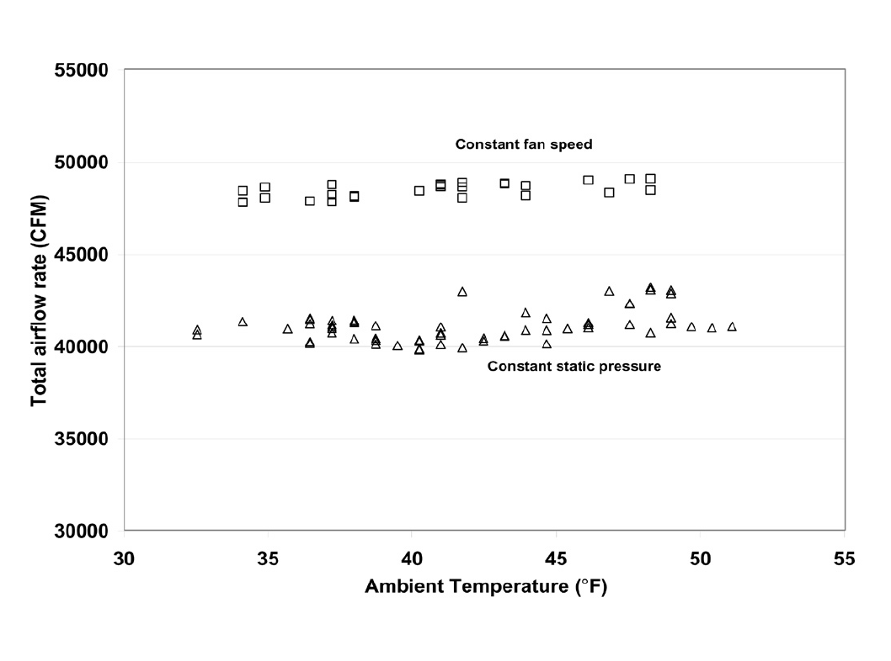

    Figure 4-19. Measured Hourly Total Air Flow for Both the CSFS and the VSFS Operations

Figure 4-20 compares the measured hourly supply fan power for the constant speed and constant static pressure operation. The average fan power was reduced from 35.8 kW for the CSFS operation to 23.1 kW for the VSFS operation. The average fan power savings of 12.7 kW corresponds to a 35% reduction in fan power. More details may be found in Joo et al. [2002].

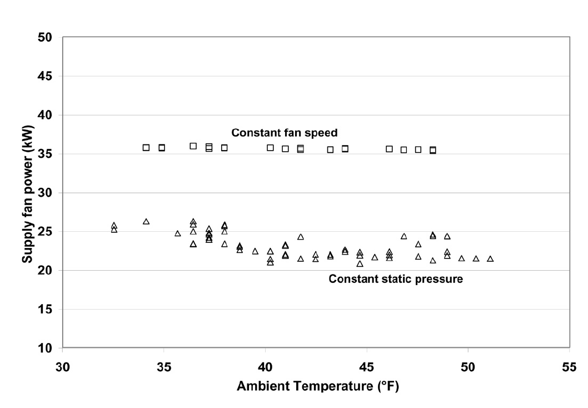

    Figure 4-20. Measured Hourly Supply Air Fan Power for Both the CSFS and VSFS Operations

4.9 VAV系统风量控制
----------------------------------------

Airflow control of VAV systems has been an important design and research subject since the VAV system was introduced. An airflow control method should: (1) ensure sufficient air flow to each space or zone, (2) control outside air intake properly, and (3) maintain a positive building pressure. These goals can be achieved using the variable speed drive volume tracking (VSDVT) method.

Figure 4-21 presents the airflow control schematic of the new VSDVT method. The physical (hard) input signals include the supply and return fan heads, the supply and return air static pressures, the return air temperature, the mixed air temperature, the outside air temperature and the return air or the critical zone CO2 concentration. The output signals include the supply fan VSD speed command, the return fan VSD speed command, the outside air damper command and the return and relief air damper command. The temperature signals are used for airflow control during economizer cycle operation.

The VSDVT has four control loops: the supply fan speed, the return fan speed, the return air damper position and the outside air damper position. For the supply fan speed loop, the controlled variable is the supply air static pressure. The controlled device is the VSD of the supply fan. This control loop maintains the set point of the supply air static pressure by modulating the supply fan VSD speed.

For the supply air control loop, the controlled variable can be the static pressure set point or the maximum air damper position. To minimize the supply fan energy, the optimal supply air static pressure should be developed based on guidelines in section 4.3 of this chapter. The supply air fan speed is modulated to maintain the static pressure set point or the damper position.

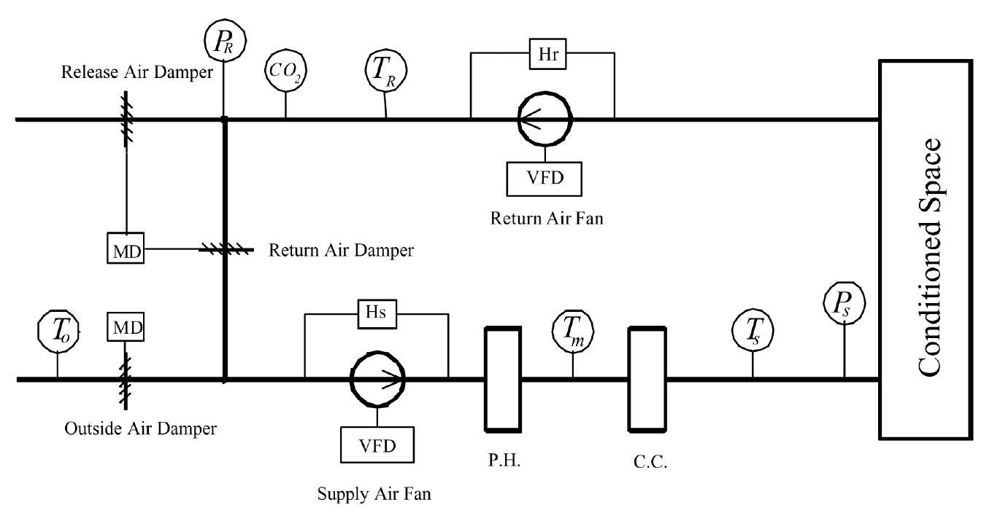

    Figure 4-21. Airflow Control Schematic of the VSDVT Method

For the return fan speed loop, the controlled variable is the return airflow rate. The controlled device is the return air VFD. The controlled loop output is the return fan VFD speed. The return airflow set point equals the difference between the supply air flow and the building exhaust and air exfiltration.

.. math::

    \dot{V_r} = \dot{V_s} - \dot{V_{ex}} - \dot{V_{exf}} 

The supply air flow can be calculated using equation 4-13 based on the supply fan VSD speed (ωs) and the fan head (Hs). The coefficients a1, a2 and a3 are polynomial regression coefficients of fan head against fan air flow at the design fan speed. The fan curve can be obtained from the fan performance cut sheet.

.. math::

    \dot{V}_s = \frac{\left( -a_1 \pm \sqrt{ a_1 ^2 - 4 a_2 \left( a_0 - \frac{H_s}{\omega_s ^2} \right) } \right) \omega_s}{2 a_2}

The sum of the exhaust air flow and exfiltration can be approximated as a constant as long as the building is maintained at a constant value of positive pressurization. This condition depends primarily on the building envelope. The tighter the building envelope, the smaller the value.

The return air flow is calculated using equation 4-14 according to the return fan VSD speed (ωr) and the return fan head (Hr). The coefficients b1, b2 and b3 are the polynomial regression coefficients of fan head against fan air flow at the design fan speed. The fan curve can be obtained from the manufacturer’s cut sheet.

.. math::

    \dot{V}_r = \frac{\left( -b_1 \pm \sqrt{ b_1 ^2 - 4 b_2 \left( b_0 - \frac{H_r}{\omega_r ^2} \right) } \right) \omega_r}{2 a_2}
    

The control loop modulates the return fan speed to maintain the return airflow set point.

For the outside air damper loop, the controlled variables are the return air static pressure and the return air or the critical zone CO2 concentration when the economizer is not activated, or the mixed air temperature when the economizer is activated. The controlled device is the outside air damper. The set point of the CO2 concentration should be predetermined using engineering principles. The set point of the return air static pressure is zero. The controller modulates the outside air damper to maintain both the CO2 and the return air pressure set points only when the return air damper is in its maximum open position. If the return air static pressure is lower than the set point, the controller opens the outside air damper farther regardless of the CO2 concentration. This prevents negative building pressure when the fresh air requirement of the occupants is less than the mechanical exhaust and the exfiltration. When the economizer is activated, the controller modulates the outside air damper to maintain the mixed air temperature set point.

For the return air damper loop, the controlled variable is the return air or the critical zone CO2 concentration when the economizer is not activated, or the mixed air temperature when the economizer is activated. The controlled devices are the return air and the relief air dampers. The relief and the return air dampers are interlinked. When the relief air damper is in the minimum position, the return air damper is in the maximum position. The return air damper loop is activated only when the outside air damper is in the fully open position. The controller decreases the return air damper opening if the CO2 concentration is higher than the set point, or if the mixed air temperature is higher than the cold deck set point during the economizer cycle. Conversely, the controller increases the return air damper opening if the CO2 concentration is higher than the set point or if the mixed air temperature is higher than the cold deck set point.

The VSDVT method reduces the fan energy by using the improved static pressure reset and decoupling the outside and return air dampers. It implements the volumetric tracking using the VSD speeds and the fan heads, and uses CO2 demand control to minimize outside air intake. The method can result in significant building pressurization control improvement and significant energy savings.

Figure 4-22 presents simulated building pressure, outside air flow, and fan power for the typical fan tracking (FT) control method. The damper positions are selected to provide the required minimum outside air flow when the supply fan provides 60% of the design air flow to the building. Outside air flow and building pressure are shown as ratios with respect to design flow and pressure. The outside air, the return and the relief air dampers are fixed at the initial condition regardless of the load conditions. A constant static pressure set point is used. The return air fan speed tracks the supply air fan speed.

The simulation results indicate that the outside air intake decreases as the total air flow decreases when the FT method is used. The AHU provides more than the design value of outside air to the space when the total air flow is higher than 60% of the design air flow. When the total air flow is at the design level, the outside air intake is 210% of the design flow. The building pressure decreases from the design value to negative values when the supply air flow is less than 54%. The typical control method used today is prone to IAQ problems, or high thermal energy consumption and building pressure control problems due to the introduction of inadequate or excessive amounts of outside air.

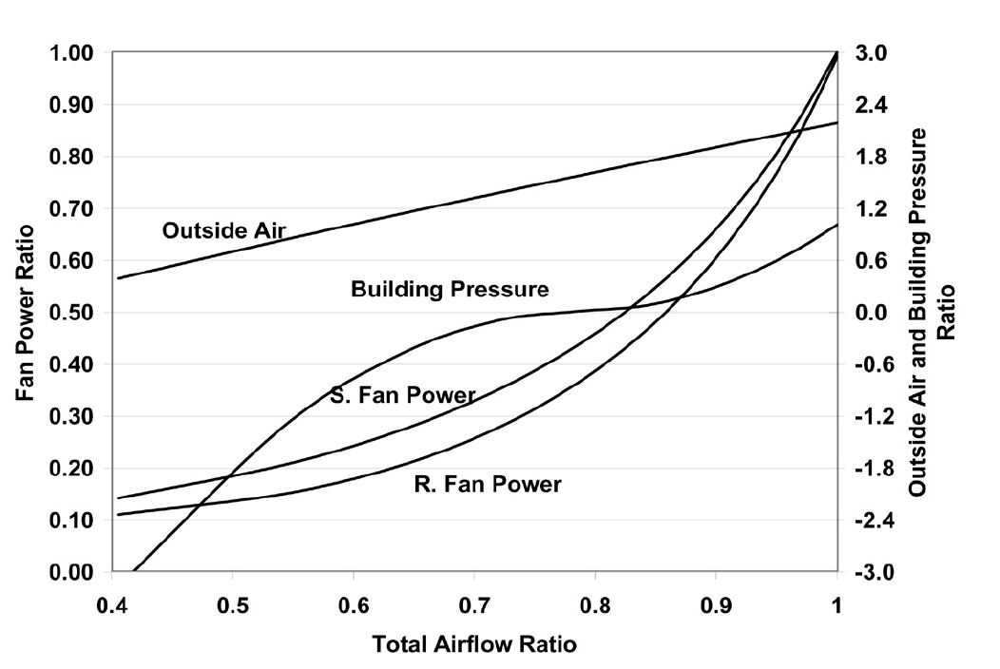

    Figure 4-22. Simulated Building Pressure, Outside Air Intake and Fan Power Using Typical Fan Tracking Control

Figure 4-23 presents the simulated results of the VSDVT method. The VSDVT method maintains constant building pressure and the required outside air intake. The fan power is significantly lower than the typical method used today.

More information can be found in “Variable Speed Drive Volumetric Tracking for Air Flow Control in Variable Air Volume Systems” [Liu 2002].

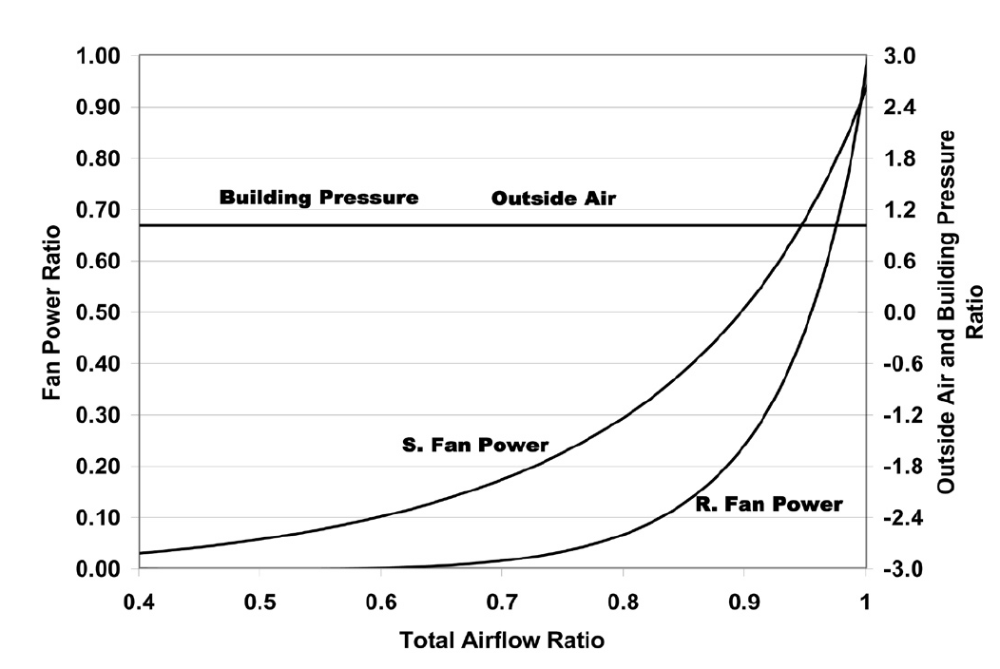

    Figure 4-23. Simulated Building Pressure, Outside Air Intake and Fan Power Using VSDVT Control

Figure 4-24 presents simulated VSDVT fan power savings compared with the typical method. The fan power savings are expressed as the ratio of the power savings to the design fan power. The maximum fan power savings are 37% for the return fan and 17% for the supply fan. Therefore, the VSDVT method can result in significant fan energy savings. The annual savings strongly depend on fan airflow distribution. Maximum fan energy savings would be achieved if the fan air flow is near 85% of the design value all of the time.

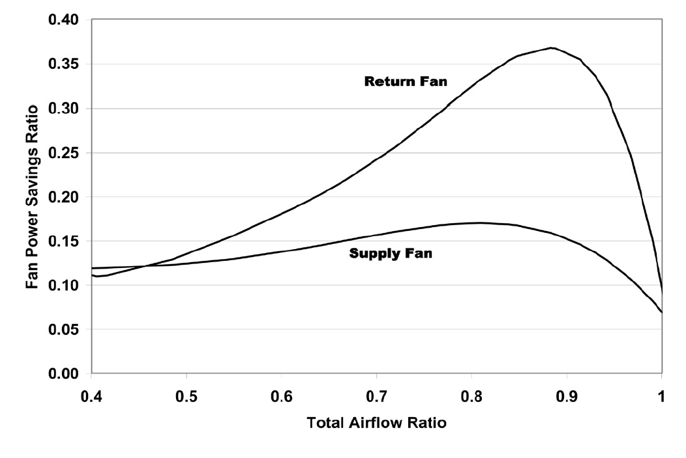

    Figure 4-24. Potential Fan Power Savings of the VSDVT Method

4.10 改善末端风盒运行
------------------------------------------

The terminal box is the end device of the AHU system. It directly controls room temperature and air flow. Improving the set up and operation are critical for room comfort and energy efficiency. The following CCSM measures are suggested:

*   Set minimum air damper position properly for pressure dependent terminal
    boxes. The minimum air damper position may be set based on ideal parallel
    damper characteristics. For example, if the minimum air flow is 30%, the
    minimum damper position is often set at 40% open. Under partial load
    conditions, the actual static pressure on the terminal box damper is higher
    than under full load conditions. Therefore, the actual minimum air flow can
    be 50% to 100% higher than the intended flow. The minimum damper
    position should be fine-tuned under partial load conditions.
*   Use a VAV control algorithm for constant air volume terminal boxes. Set the
    minimum air flow at the maximum for a constant airflow box during occupied
    hours. The terminal box will behave the same as a constant air volume
    terminal box. Set minimum air flow to zero or almost zero during unoccupied
    hours in order to significantly improve energy performance.
*   Use airflow reset. Reset the minimum air flow to a lower value, possibly zero,
    during unoccupied hours and lightly occupied hours.
*   Integrate lighting and terminal box control. Occupancy sensors are
    increasingly used to turn lights off when a space is unoccupied. Reset the
    minimum airflow lower, or to zero, and turn off lights when the occupants are
    not present. Note that this signal should not be used to change the room
    temperature set point.
*   Integrate airflow and temperature reset. The potential energy savings of room
    temperature reset are relatively small for the following reasons:

        - The minimum airflow ratio (minimum airflow over the design airflow) is
          often higher than the load ratio during unoccupied hours. No savings will
          occur.
        - Commercial buildings have high thermal capacity. Heat stored during
          unoccupied hours is eventually removed by the AHU during occupied
          hours.
        - The chiller efficiency is higher at night than during the daytime. The
          electricity price may be also higher during the daytime. Temperature resets
          may actually increase cost.

In large commercial buildings, airflow reset may result in the same amount of savings produced by combined air flow and temperature reset.

* Improve terminal box control performance. The following tips can help
  significantly:

    - Set a minimum 2°F dead band between the heating and cooling set points.
      This will prevent frequent switching from heating to cooling or vice versa.
    - Set the terminal box maximum air flow to the highest possible value. If a
      box has a capacity of 500 cfm, the maximum air flow should be
      programmed to 500 cfm instead of the design value of 400 cfm. This may
      reduce the maintenance effort and decrease hot complaints. However, this
      may overload the fan during start up. Therefore, this can only be
      implemented in a limited number of terminal boxes. A fan speed
      limit should also be implemented for start up.
    - Set the minimum air flow based on actual building use rather than design
      values. For example, if the ventilation air was designed for 6,000 people
      and the actual census is 1,800 people, set outside air for 1,800 people.
    - Use different minimum airflow set points to minimize energy waste.
      Some perimeter reheat zones have their minimum flow set based on the
      heating load. The required minimum flow during the cooling season is
      often lower.
    - Verify flow sensor accuracy. If the inlet conditions are poor and not
      compensated in the flow sensor calibration, a calibration should be
      conducted.

More information can be found in “Terminal Box Airflow Reset: An Effective Operation and Control Strategy for Comfort Improvement and Energy Conservation” [Liu et al. 2002] and “Optimization Control Strategies for HVAC Terminal Boxes” [Zhu et al. 2000]

EXAMPLE:

Airflow reset was implemented in a dual duct variable air volume system in a medical building in Houston, Texas. The AHU had 45 terminal boxes with a 40 hp. supply air fan. The design air flow was 19,650 cfm. The occupied hours were from 8:00 a.m. to 7:00 p.m., Monday through Friday.

The design schedule required a minimum air flow from 40% to 70% with an average of 60%. This schedule was used during occupied and unoccupied hours. Airflow reset changed the minimum air flow to 20% for all boxes. Since the exhaust air fan could not be turned off, the minimum air flow from the AHU maintained the positive building pressure. To save fan power, the static pressure was at 0.5 in. H2O.

Airflow reset can be implemented using existing box control algorithms for some terminal boxes when the airflow reset is built into the box controller. Most terminal box controllers, however, do not have this option, which was the case for this building. Two box control schedules were programmed in the central control system. The daytime terminal box control sequence had a higher minimum airflow set point than the nighttime control sequence. At the beginning of the occupied period, the daytime control schedule was downloaded to each box. At the beginning of the nighttime period, the nighttime schedule was downloaded to each box from the central control system. The download was automatically performed using a schedule based on the time of the day and the day of the week.

Airflow reset was implemented on the last week of September 1997. The hourly ambient temperature and variable frequency drive (VFD) speed were recorded from August 1 to November 25. The airflow rate was calculated using VFD speed, design fan head and VFD speed.

Figure 4-25 presents the airflow ratio versus ambient temperature during unoccupied hours. Before implementation of airflow reset (August 1 to September 23), the nighttime air flow varied from 60% to 70% of the design value. After implementation (October 1 to November 25), the nighttime air flow varied from 20% to 30%. The airflow reset decreased air flow by 40% of design flow during unoccupied hours.

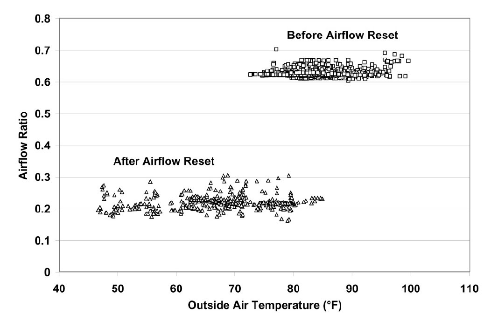

    Figure 4-25. Comparison of Air Flow Before and After Airflow Reset During Unoccupied Hours (Airflow Ratio is defined as the ratio of the air flow to the design air flow)

**References**

Hartman, T., 1989. “RAV – A new HVAC concept,” Heating/Piping/Air Conditioning, July, pp. 69 –73.

Joo, I. and M. Liu, 2002. “Economizer Application in Dual-Duct Air Handling Units,” Proceedings of Thirteenth Symposium on Improved Building Systems in Hot and Humid Climates, May 20-23, Houston, Texas, pp. 373-380.

Joo, I., M. Liu, K. Conger and G. Wang, 2002. “Variable Speed Drive (VSD) Application in Dual Duct Constant Volume Systems,” Proceedings of Thirteenth Symposium on Improved Building Systems in Hot and Humid Climates, May 20-23, Houston, Texas, pp. 206-212.

Liu, M. A. Athar, A. Reddy, D. E. Claridge, J. S. Haberl and Ed. White, 1995. “Reducing Building Energy Costs Using Optimized Operation Strategies for Constant Volume Air Handling Systems” ASHRAE Transactions-Symposia. Volume 101, Part 2, pp. 688-700.

Liu, M., Y. Zhu, M. Abbas, R. D. L. Cruz, J. Perez, D. E. Claridge, D. Feary and J. Gains, 1996. “An O&M Story in An Old Building,” Proceedings of Fourth National Conference on Building Commissioning, St. Pete Beach, FL, April 29 to May 1, pp. 14.3.1-14.3.14.

Liu, M., D. E. Claridge and B. Y. Park, 1997a. “An Advanced Economizer Controller for Dual Duct Air Handling Systems With a Case Study,” ASHRAE Transactions-Research. Volume 103, Part 2, pp. 256-263.

Liu, M., Y. Zhu, D. E. Claridge and Ed. White, 1997b. “Impacts of Static Pressure Set Level on the HVAC Energy Consumption and Indoor Conditions,” ASHRAE Transactions-Research. Volume 103, Part 2, pp. 221-228.

Liu, M., Y. Zhu, T. Powell and D. E. Claridge, 1998a. “System Optimization Saves $195,000/yr. in a New Medical Facility,” Proceedings of the 6th National Conference on Building Commissioning, Lake Buena Vista, Fla., May 18-20, pp. 14.2.1-14.2.11.

Liu, M., M. Abbas, B. Veteto and D. E. Claridge, 1998b. “Impacts of Optimized Cold & Hot Deck Reset Schedules On Dual Duct VAV System-Application and Results,” The Eleventh Symposium on Improving Building Systems in Hot and Humid Climates Proceedings, June 1-2, Fort Worth, Texas, pp. 153-160.

Liu, M. and D. E. Claridge, 1998. “Impacts of Optimized Cold & Hot Deck Reset Schedules on Dual Duct VAV Systems-Theory and Model Simulation,” The Eleventh Symposium on Improving Building Systems in Hot and Humid Climates Proceedings, June 1-2, Fort Worth, Texas, pp. 146-152.

Liu, M., Y. Zhu, B. Y. Park, D. E. Claridge, D. Feary and J. Gain, 1999. “Air Flow Reduction To Improve Building Comfort and Reduce Building Energy Consumption,” ASHRAE Transactions, Vol. 105, Part I, pp. 384-390.

Liu, M. and D. E. Claridge, 1999a. “Converting Dual Duct Constant Volume Systems to Variable Volume Systems Without Retrofitting the Terminal Boxes,” ASHRAE Transactions, Vol. 105, Part I, pp. 66-70.

Liu, M. and D. E. Claridge, 1999b. “The Maximum Potential Energy Savings from
Optimizing Cold and Hot Deck Reset Schedules for Dual Duct VAV Systems,” Journal of Solar Energy Engineering, Vol. 121, pp. 171-175.

Liu M. and J. Wang, 2001a. “System Performance Analysis of Coupled Control Units With Both Thermostat and Humidistat,” Proceedings of the ASME International Solar Energy Conference 2001, April 21-25, Washington, D. C., CD-ROM.

Liu M. and J. Wang, 2001b. “System Performance Analysis of Coupled Control Units Without Humidistat,” Proceedings of the ASME International Solar Energy Conference 2001, April 21-25, Washington, D. C., CD-ROM.

Liu, M., M. Abbas, Y. Zhu and D. E. Claridge, 2002. “Terminal Box Air Flow Reset: An Effective Operation and Control Strategy for Comfort Improvement and Energy Conservation,” Proceedings of Thirteenth Symposium on Improved Building Systems in Hot and Humid Climates, May 20-23, Houston, Texas, pp. 80-86.

Liu, M., 2002. “Variable Speed Drive Volumetric Tracking (VSDVT) for Airflow Control in Variable Air Volume (VAV) Systems,” Proceedings of Thirteenth Symposium on Improving Building Systems in Hot and Humid Climates, May 20-23, Houston, Texas, pp. 197-205.

Wei G., D. E. Claridge and M. Liu, 2000a. “Optimize the Supply Air temperature Reset Schedule for Single-duct VAV Systems,” Proceedings of Twelfth Symposium on Improving Building Systems in Hot and Humid Climates, May 15-16, San Antonio, Texas, pp. 154-157.

Wei, G., D. E. Claridge, Y. Sakurai and M. Liu, 2000b. “Improved Air Volume Control Logic, “ Proceedings of Twelfth Symposium on Improving Building Systems in Hot and Humid Climates, May 15-16, San Antonio, Texas, pp. 195-198.

Wei, G., W. D. Turner, D. E. Claridge, M. Liu, M. J. Hewett and M. W. Hancock, 2001. “Continuous Commissioning of a Hospital Complex,” Proceedings of National Conference on Building Commissioning, pp. 19-2.1-19-2.10.

Zhu, Y., M. Liu, D. E. Claridge, W. D. Turner and T. Lewis, 1998. “A Novel Procedure to Determine Optimal Air Static Pressure Set-points and Reset Schedules in VAV Air Handling Units,” Proceedings of the Eleventh Symposium on Improving Building Systems in Hot and Humid Climates, June 1-2, Ft. Worth, Texas, pp. 294-301.

Zhu, Y, M. Liu, T. Batten, H. Noboa, D. E. Claridge and W. D. Turner, 2000. “Optimization Control Strategies for HVAC Terminal Boxes, “ Proccedings of the Twelfth Symposium on Improving Building Systems in Hot and Humid Climates Proceedings, May 15-16, San Antonio, Texas, pp. 278-284.