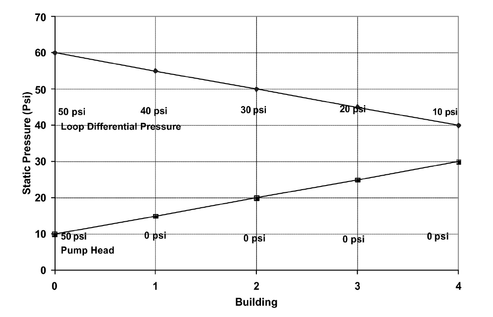

第五章 水/蒸汽输配系统的连续调试措施
=======================================================

Distribution systems include central chilled water and hot water/steam systems, that deliver thermal energy from central plants to buildings. In turn, the system distributes the chilled water and hot water or steam to AHU coils and terminal boxes. Distribution systems consist mainly of pumps, pipes, control valves and variable speed pumping devices.

.. sidebar:: **Notes**

    Distribution systems consist mainly of pumps, pipes, control valves and variable speed pumping devices.

A central chiller plant could have primary and secondary loops. The primary pumps are only used to circulate water through the chillers. The secondary pumps are used to distribute water to the buildings. The distribution systems can be categorized as source-distributed and distributed systems. The source-distributed system has secondary pumps located only in the central plant. The distributed pumping system has pumps located in the buildings but with no secondary pumps. Most central plants are not pure source-distributed nor pure distributed systems. Most have all three types of pumps: primary, secondary, and building pumps.

.. figure:: _static/Figure5_1.png
    :align: center
    :figwidth: 600px

    Figure 5-1. Schematic Diagrams of Source Distributed Pumping (on left) and Distributed Pumping Configurations

This chapter focuses on the CCSM measures for optimal pressure control, water flow control, and general optimization. The supply temperature and steam optimization measures are covered in Chapters 6 and 7.

5.1 改善建筑冷水泵运行
---------------------------------------------------

Most building chilled water pumping systems are equipped with variable speed devices (VSDs). If a VSD is not installed, retrofit of a VSD is generally recommended. The discussion here is limited to systems where a VSD is installed. The goal of pumping optimization is to avoid excessive differential pressures across the control valves while providing enough water to each building, coil, or other end use1. Optimal pump operation schedule should be developed using the following procedure:

*   Inspect each heating and cooling coil. Identify all three-way valves. Convert
    three-way valves into two-way valves by closing the manual valves on the
    bypass line. If necessary, cut the bypass line. In rare cases, the three-way valves may hydraulically lock if the bypass is fully closed. In these cases, the three-
    way valves must be replaced.
*   Inspect the building entrance. Disable any blending station that allows return
    water to blend with primary water from the central plant using manual valves
    or by closing off the bypass line. Note that if the chiller plant provides chilled
    water to only one building, the primary/secondary loops may be converted into
    a single loop. Single-loop operation or conversion is discussed later in this
    chapter.
*   Identify the coil which calls for the highest differential pressure to deliver the
    required flow. Open all manual valves between this coil and the building pump.
    Check the coil supply air temperature set point. If the set point is lower than
    the design value, reset it back to the normal value.
*   Slow the pump down until the control valve at the coil is 85% open. After the
    system is stabilized, measure the differential pressure (ΔP1) at the loop sensor
    position and the chilled water flow rate. The differential pressure (ΔP1) is the
    optimal set point (ΔPo) under the measured flow condition.
*   If step 4 cannot be performed, measure the differential pressure across the coil
    (ΔP2), including the valve, the differential pressure (ΔP1) at the loop sensor, and
    the chilled water flow rate (Go). Determine the set point of the optimal loop
    pressure as:

    .. math::
      
        \Delta P_0 = \Delta P_1 - \Delta P_2 + C 

    The constant C is the differential pressure required by the coil. It typically
    varies from 1 to 5 psi depending on the size of the coil. However, exceptions are
    possible. If a value above this range is detected, compare it with the design
    value. If it is higher than the design value, the coil may be blocked. Cleaning or
    repair may be required.

*   If the differential pressure sensor is located at the most remote coil, control the
    VSD to maintain the set point
*   If the differential pressure sensor is not located at the most remote coil, reset
    the differential pressure set point using measured chilled water flow rate.
    The reset schedule may not apply to extremely low flow conditions. A low limit
    is often necessary. Generally, the set point should not be lower than 5 psi. A
    high limit is also recommended in case the flow meter malfunctions. The high
    limit should be calculated by introducing the design flow for G in the equation
    for ΔP.

    .. math::

        \Delta P = \Delta P_0 \left( \frac{G}{G_0} \right) ^2 + 2

    Turn off the building pump(s) if the primary/secondary loop provides enough
    differential pressure to the building.

*   If the chilled water flow is not measured, the differential pressure can be reset
    based on the VSD speed as:

    .. math::

        \Delta P = \Delta P_0 \left( \frac{VSD}{VSD_0} \right) ^2 + 2

    where VSD0 is the VSD speed when ΔP0 is determined.

*   Implementat the optimal reset schedule using the BAS. After initial
    implementation, hot complaints may occur due to existing mechanical
    problems or incorrect manual valve positions. When a hot call is
    received, check the appropriate coil. Special attention should be given to
    balance valve positions and any other valve position in that branch. Take action
    to properly balance the system. If the problem persists, check the coil and its
    valves to identify any mechanical problems and repair. If this does not solve
    the problem, this coil should be used as the most remote coil.

More information can be found in “A Simple and Quick Chilled Water Loop Balancing for Variable Flow Systems” [Zhu et al. 2000], and “System Optimization Saves $195,000/yr in a New Medical Facility” [Liu et al. 1998].

EXAMPLE:

The G. R. White Annex is part of the G. R. White Coliseum on the Texas A&M University Campus in College Station. The total conditioned space is 177,838 square feet, which includes classrooms, offices and gym areas. Two chilled water pumps (40 hp. each) are installed to circulate water in the building. A VFD is installed on the lead pump with the other pump as a standby pump. The differential pressure sensor is installed at the entrance of the building loop.

The original differential pressure set point varied from 15 psi to 54 psi as the chilled water flow varied from 50% to 100% of design flow. During most of the year, this schedule caused the pump to run at full speed.

A test was conducted. The measured optimal set point was 10 psi when the chilled water flow was 275 gpm. The optimal reset schedule was then constructed as:

    .. math::

        \Delta P = 10 \left( \frac{G}{275} \right)  + 2

The minimum limit was set as 5 psi. The high limit was set at 15 psi. Figure 5-2 compares the measured chilled water flow rate before and after the implementation of the optimal reset schedule.

.. figure:: _static/Figure5_2.png
    :align: center
    :figwidth: 600px

    Figure 5-2. Comparison of Measured Chilled Water Flow Under Both Initial and Optimal Differential Pressure Reset Schedules

Under the initial schedule, the pump was running at full speed. Under the new schedule, all control valves can function properly. The chilled water flow was reduced by 50% and building comfort was still maintained. The optimal schedule decreased pump power by 20 kW based on a one-time measurement.

After implementing the optimal chilled water loop differential reset schedule, the supply air temperature was maintained at the set point. Cold complaints were significantly reduced and simultaneous heating and cooling decreased. Figure 5-3 compares the measured hourly cooling energy consumption under both the original and optimal chilled water differential reset schedules. Under the same temperature conditions, the chilled water consumption was approximately 250 kBtu/hr lower under the optimal schedule. This translated into 2,000 MMBtu/yr chilled water energy savings. If the building comfort is maintained at the same level, the same amount of heating energy savings should be obtained. The annual energy cost savings were estimated to be $28,760/yr. This includes $8,760 for pump power, $10,000 for chilled water, and $10,000 for hot water based on energy prices of $0.05/kWh, and $5/MMBtu for hot water and chilled water.

The pump control may also be improved by controlling the pressure so that at least one control valve is at least 85% open (adjustable). If none of the control valves are at least 85% open, slow down the pump and vice versa. This method requires special attention to all control valves. A single malfunctioning valve may cause the pump to run at full speed. Generally speaking, this method should be integrated with the pressure reset schedule. If the actual differential pressure approaches the set point and one control valve is still fully open, it often indicates a problem associated with the valve or the coil controlled by the valve.

.. figure:: _static/Figure5_3.png
    :align: center
    :figwidth: 600px

    Figure 5-3. Comparison of Chilled Water Energy Consumption Under Original and Optimal Chilled Water Differential Pressure Schedules

5.2 改善二级环路运行
--------------------------------------
The building loop optimization should be performed before the secondary loop optimization.

5.2.1 Source Distributed Systems
^^^^^^^^^^^^^^^^^^^^^^^^^^^^^^^^^^^^^^

If there are no building pumps, the secondary pumps must provide the pressure head required to overcome both the secondary loop and the building loop pressure losses. In this case, the secondary loop is called a source distributed system. The secondary loop pumps should be controlled to provide enough pressure head for the most remote coil. If VFDs are installed, the differential pressure can be controlled by modulating pump speed. Otherwise, the differential can be modulated by changing the number of pumps in operation.

.. sidebar:: **Notes**

    Installing building pumps can decrease total pumping power by as much as 50%.

The source-distributed system is the least efficient distribution system. Installing building pumps can decrease total pumping power by as much as 50% when the pumps are controlled and operated properly. The source distributed system will often have water balance problems because it over-pressurizes the control valves of the buildings nearest to the central plant. Due to excessive water flow through these buildings, often the remote buildings do not receive enough water. Alternatively, the distribution pump at the central plant must pump extra water. It is recommended that building pumps be installed for relatively large complexes with several buildings.

5.2.2 Source Distributed Systems With Building Pumps
^^^^^^^^^^^^^^^^^^^^^^^^^^^^^^^^^^^^^^^^^^^^^^^^^^^^^^^^^^^^^^^^^^^^^^^^^^^^

In most campus settings, both secondary distribution and building pumps are installed. The optimal differential pressure set point should be determined using the following procedure:

*   Inspect major buildings and solve any major water balance problems.
*   Identify the most remote building. Inspect the building and identify any control
    and mechanical problems in the major AHUs. Fix major mechanical and control
    problems for the cooling coils.
*   Modulate the secondary loop pump until the building pump in the most remote
    building runs at full speed while maintaining building comfort. Record the
    secondary chilled water flow rate (Go), and loop differential pressures (ΔPpo) at
    the central plant (ΔP at the sensor location) and the remote user entrance (ΔPbo).
    Measure the pump head (Hp). If the secondary loop ΔP sensor is located at the
    entrance of the most remote building, ΔPp should be reset based on the
    measured loop flow rate using the following formula:

    .. math::

        \Delta P_p = \left( H_p + \Delta P_{b0} \right) \left( \frac{G}{G_0} \right) ^2 - H_p + 2

    If the secondary loop ΔP sensor is located at the central plant, ΔPp should be
    reset based on the measured loop flow rate using the following formula:

    .. math::

        \Delta P_p = \left( H_p + \Delta P_{p0} \right) \left( \frac{G}{G_0} \right) ^2 - H_p + 2

    A maximum limit should be imposed on the reset schedule.

*   If secondary pumps cannot be adjusted during the test, follow the procedure
    below:

        - Select a manual valve in the main chilled water loop of the building
        - Adjust the valve until the building pump runs at full speed and the
          maximum opened chilled water control valve is 85% open
        - Record the secondary chilled water flow rate (Go), loop differential
          pressure (ΔPpo) at the central plant (ΔP at the sensor location) and the most
          remote building entrance (ΔPbo). Measure the pump head (Hp). Record the
          pressure loss across the manual valve (ΔPl).
        - If the secondary loop ΔP sensor is located at the entrance of the most
          remote building, the ΔPp should be reset based on the measured loop flow
          rate using the following formula:

            .. math::

                \Delta P_p = \left( H_p + \Delta P_{b0} \right) \left( \frac{G}{G_0} \right) ^2 - H_p - \Delta P_l + 2

        - If the secondary loop ΔP sensor is located at the central plant, the ΔPp
          should be reset based on measured loop flow rate using the following
          formula:

            .. math::

                \Delta P_p = \left( H_p + \Delta P_{p0} \right) \left( \frac{G}{G_0} \right) ^2 - H_p - \Delta P_l + 2

          A maximum limit should be imposed on the reset schedule.

*   The optimal reset schedule can be easily implemented using the BAS. After
    initial implementation, hot calls may occur due to existing mechanical problems
    or incorrect manual valve positions. When a hot call is received, check the
    building controls and mechanical systems. Special attention should be given 
    to balance valve positions and any other valve position in the branch. Take
    action promptly to balance the system. If the problem persists, check the
    building to identify mechanical problems and repair. If this does not solve the
    problem, this building should be treated as the most remote building.
*   Turn off building pumps where the secondary pump provides enough pressure
    difference to the building loop

The advantages of optimizing the secondary loop control can be demonstrated best using the simplified example below. Consider the simplified loop shown in Figure 5-4. We assume that the secondary loop has a pressure drop of 5 psi between the plant and the first building, as well as between each successive building. The pressure drops on the return side of the loop are the same as in the supply side of the loop. A building pump is available in each building and flow through each building is 1000 gpm. Assume that each building loop has a 10 psi pressure drop. We want to find the loop pressure that meets these flow requirements and minimizes the combined building and loop pumping power.

.. figure:: _static/Figure5_4.png
    :align: center
    :figwidth: 600px

    Figure 5-4. Loop and Building Flows and Pressure Drops for Example Problem

We first consider source distributed pumping where the secondary loop pumps provide all the pumping power for the loop and the buildings as shown in Figure 5-5. This figure shows the differential pressure distribution throughout the loop. We see that 10 psi will be needed for the last building. We also assume 10 psi at the return to meet NPSH requirements for the secondary pump. In a real system, the static pressure will satisfy the positive pressure in the entire system. We note that the excess differential pressure for each of the first three buildings, 30 psi to 10 psi, must be dropped across valves in the buildings.

    Figure 5-5. Differential Pressure Distribution for Source Distributed Pumping

The pump power depends on flow rate, pump head and pump efficiency:

Ppump = VΔP/η

where V is the volumetric flow rate, ΔP is the differential pressure drop, and η is the pump efficiency. This equation gives the answer in ft-lbf/s, so we will use the equation

Ppump = 0.000597GΔP/η

where now G is in gpm, ΔP is in psi and the answer is in hp.

For source distributed pumping, if we have a pump efficiency of 0.83, we get:

Ppump = 0.000597*4*1000gpm*50 psi/0.83 = 144 hp.

If we use the combination of source and distributed pumping shown in Figure 5-6, we note that we now have 20 psi differential pressure across the secondary pump that still pumps 4000 gpm. The first building obtains its pumping power from the secondary loop. Therefore, the building pump is off. The second building has a flow of 1000 gpm pumped across 10 psi, the third building has 1000 gpm pumped across 20 psi and the fourth building has 1000 gpm pumped across 30 psi. Hence we obtain:

Ppump = 0.000597*[4000gpm*20 psi+1000 gpm*(10 psi + 20 psi + 30 psi)]/0.83
= 101 hp.

If we evaluate the pumping power required for all possible combinations ranging from source pumping to distributed pumping for this system, we arrive at the plot shown in Figure 5-7.

Here we see that, for this system, pure distributed pumping or a combination of source and distributed pumping provides a loop pump head of up to 20 psi and building pumping in three or four of the buildings. All have the same pumping power requirements. The pumping power then increases as the loop pump head is increased to reach a maximum value for pure source pumping. The savings of the optimum combinations are (144-101)/144*100 = 30%. 

.. figure:: _static/Figure5_6.png
    :align: center
    :figwidth: 600px

    Figure 5-6. Differential Pressure Distribution for the Evaluation of Combined Source and Distributed Pumping

 

    Figure 5-7. Pumping Power as a Function of Loop Pump Head for the System Considered in the Example

EXAMPLE:

The main campus of Texas A&M has 107 buildings. The central heating plant, located at the north end of the main campus, distributes heating water through two loops to all buildings using three distribution pumps with a total capacity of 1025 hp. The longest branch of the loop is 0.53 miles (2,800 feet). Building pumps are installed in each building and most buildings have standby pumps. Excluding the standby pumps, the building pumps have a total capacity of 947.5 hp. VFDs are installed in 21 buildings that have a total heating pump capacity of 214.5 hp.

Before optimizing the heating loop operations, all building heating pumps operated continuously. The central plant maintained differential pressure within a range of 50 psi to 60 psi using manual control (changing the number of pumps in operation). The heating water temperature was set at 180 °F.  

In the winter of 1996-1997, optimization of the heating loop was conducted. The main activities are summarized below:

*   All three-way valves and blending stations were closed. Blending stations were
    used in 106 buildings. 86 blending stations were disabled using manual valves.
    20 blending stations were disabled by blocking the bypass lines. Most three-way
    valves at AHUs were converted into two-way valves by closing the manual
    valves on the bypass lines.
*   A large pump was installed in the most remote building, the Commons
    Dining Hall. The Commons Dining Hall is located at the very end of the
    heating water loop. The building used a pump with a 30 hp. motor. However,
    its pump head is less than 10 psi since its impeller was trimmed some years
    earlier. No records were found as to when or why the impeller was trimmed.
    Engineering calculations showed that a 30 psi pump head for this building
    would align it with adjacent buildings and provide the best overall loop
    performance. To correct the problems, a new 10 hp. pump was installed.
*   The loop differential pressure was reset from 30 psi to 40 psi as a linear
    function of the ambient temperature as it varies from 100°F to 30°F. The
    operating staff preferred to use ambient temperature instead of flow rate as the
    basis for resetting the hot water loop differential pressure because of control
    system limitations and other factors.
*   The hot water temperature was reset from 180°F to 140°F. Since most buildings
    were using blending stations, 140°F temperatures can satisfy the requirement of
    most buildings. Minor system commissioning was conducted in a few
    buildings, such as the Chemistry building, to resolve existing building problems
    and reduce the required hot water temperature to 140°F.
*   The building heating water pumps in 60 buildings were turned off, resulting in
    a total 400 hp. reduction in capacity

Figure 5-8 presents a schematic of the campus heating water distribution diagram. Pumps in buildings shaded with gray have been turned off permanently. This results in pump power savings of 400 hp. Due to the reduced differential pressure set point, the central plant runs one pump less than under the original schedule. This results in additional pump power savings of 300 hp. The total pump power savings are approximately 700 hp., or 35%, of the original total pumping power (1972 hp.). Since the heating systems run 24 hours per day, the annualized energy savings are estimated to be 4,500 MWh. The potential cost savings are $225,000/yr at an average electricity cost of $0.05/kWh.

The reduced loop differential pressure reduced hot calls significantly in the buildings nearest the central plant. Under the original schedules, the building heating water loop experienced excessive pressure differences and the heating water control valves were not able to function properly. Consequently, the room temperatures were not properly maintained and excessive thermal energy was used. More information about this case study can be found in “Reducing Pump Power Consumption by (1000 kW) 40% Through Improved Pump Management in a Central Plant” [Deng et al. 1998].

    Figure 5-8. Schematic Diagram of Central Heating System on the Texas A&M University Main Campus in College Station

5.3 改善中央冷站水路运行
---------------------------------------------------

The central plant loop optimization should be performed after secondary loop optimization.

5.3.1 Single Loop Systems
^^^^^^^^^^^^^^^^^^^^^^^^^^^^^^^^^^^^^^

For most heating distribution systems and some chilled water systems, a single loop is used instead of primary and secondary systems. Under partial load conditions, fewer pumps can be used for both chillers and heat exchangers. This can result in less pump power consumption. The following procedures should be followed to
optimize the system operation:

*   Balance chiller or heat exchanger loops to maintain the same ratio of flow
    through each chiller or heat exchanger. Ensure that all manual valves are fully
    open in at least one branch. This minimizes the loop pressure loss to save pump
    power.
*   Adjust the flow switch on the chiller. Ensure that the switch sends a flow signal
    to the chiller control if the flow is higher than the minimum flow. Typically,
    the flow switch is set at the design flow rate. This can be decreased to 30% of
    the design flow rate for most chillers without causing any damage. The chiller
    manufacturer should be consulted for verification of the low flow setting.
*   Under partial load conditions, match the pump flow rate to the entire chiller
    plant load ratio. For example, assume a central chiller plant has four chillers
    with a total capacity of 4,000 tons. If the load is 2,000 tons, two pumps and
    three chillers should be turned on. Each chiller operates at its most efficient
    load ratio of 67%. Each pump has a load ratio of 100%.
*   Adjust the automatic control valve (isolation or shut off valve) cycle time to
    at least 60 seconds if old chillers (5 years or older) are used
*   Verify that the pump will not overload. Find the current working point on the
    pump curve and identify future working points or ranges. Ensure that the pump
    brake hp. will not exceed the pump motor capacity.

EXAMPLE:

The Materials Research Institute (MRI) building, located in State College, PA, has a total floor area of 50,000 square feet including offices, classrooms, laboratories and a clean room facility.

Figure 5-9 presents a schematic diagram of the central plant chiller system. Two 285-ton York chillers are installed in parallel. The design chilled water flow rate is 570 gpm. The chilled water pumps are 25 hp. each with a design pump head of 100 feet of water column and a flow of 695 gpm. This is 22% higher than the rated chiller flow.

An automatic control valve is installed for each chiller. The pressure loss across the chiller is monitored. If the pressure loss is higher than the set point, the automatic valve closes and vice versa. Another automatic control valve is installed on the building by-pass line. If the building loop differential pressure is higher than the set point (25 psi), the bypass valve opens to maintain the set point.

.. figure:: _static/Figure5_9.png
    :align: center
    :figwidth: 600px

    Figure 5-9. Schematic Diagram of Chiller Plant at MRI Building

On September 10, 1998, a field inspection found that (1) the manual valve on the chiller exit was 50% closed and (2) the automatic valves were 50% closed when two chillers were on. The chilled water return temperature to the chillers was 47°F. Chiller supply temperature was 41°F. The building chilled water return temperature was 54°F. Approximately 54% of the chilled water bypassed the building loop.

A test measured a chilled water flow rate of 550 gpm when one chiller was on with one pump. When two chillers were on, the chilled water flow rate was measured to be 400 gpm for each chiller with one pump on.

To improve the chilled water loop operation, the following actions were taken:

* The building loop differential pressure set point was increased from 25 psi to
  35 psi
* The chiller loop section was balanced and each chiller was determined to have
  the same flow rate. All manual valves were opened to 100%. Since it is a
  parallel loop, balancing only required opening the valves.
* York was contracted to verify that the chillers can be operated safely if the
  chilled water flow is at least 150 gpm, or 26% of the design flow rate
* Only one pump was controlled to run regardless of the number of chillers in
  operation. According to the pump curve shown in Figure 5-10, the pump power
  will be less than 25 hp. if the chilled water flow is less than 930 gpm. Since the
  maximum building chilled water flow is less than 700 gpm based on measured
  data, the chilled water pump will not be overloaded. Note that the building loop
  differential pressure set point was raised from 25 psi to 35 psi. The increased
  setpoint prevents excessive building bypass. Consequently, it prevents
  excessive pump flow and pump overloading.
* An operating technician implemented the procedure following the formal
  recommendations by the CCSM engineer.

The improved pump operating procedures turned off one pump for 4 months, according to the operating log. Consequently, the pump energy savings were estimated to be 53,640 kWh/yr, or $3,754/yr assuming an electricity price of $0.07/kWh.

    Figure 5-10. Chilled Water Pump Curve (regenerated using pump curves from TACO, TA Series Model 1229, speed 1760 RPM, and 10.25” impeller)

5.3.2 Primary and Secondary Loop Systems
^^^^^^^^^^^^^^^^^^^^^^^^^^^^^^^^^^^^^^^^^^^^^^^^^^^^^^^^^^^^^^^^^^^^^^^^^^^^

Primary and secondary systems are the most common chilled water distribution systems used with central chiller plants. This design is based on the assumption that the chilled water flow through the chiller must be maintained at the design level. This is seldom needed. Due to this incorrect assumption, a significant amount of pumping power is wasted in numerous central plants. Design engineers sometimes include an isolation valve on the bypass line of the primary loop. Sometimes, no valve is included. If no isolation valve is incorporated in the system, the following procedures should be followed to optimize system operation:

*   Balance chiller loops to maintain the same flow ratio (chilled water flow over
    the design flow) through each chiller. Ensure that all manual valves are fully
    open in at least one branch.
*   Adjust the flow switch on each chiller. Ensure that the switch sends a flow
    signal to the chiller control if the flow is higher than the minimum flow.
    Typically, the flow is set at the design flow rate. This can be decreased to 30%
    of the design flow rate.
*   Match the pump flow rate to the entire load ratio under partial load conditions.
    For example, assume a central chiller plant has four chillers with a total
    capacity of 4,000 tons. If the load is 2,000 tons, two pumps and three chillers
    should be turned on. Each chiller then has a load ratio of 67% and each pump
    has a load ratio of 100%. It is recommended that chillers not run at load ratios
    higher than 80% or lower than 40%.
*   Adjust automatic control valve cycle time to at least 60 seconds if older chillers
    (5 years or older) are used
    If an isolation valve is installed, the following procedures should be followed to
    optimize the pump operation.
*   Balance chiller loops to maintain the same flow ratio through each chiller.
    Ensure that all manual valves are fully open in at least one branch.
*   Adjust the flow switch on each chiller. Ensure that the switch sends a flow
    signal to the chiller control if the flow is higher than the minimum flow.
    Typically, the flow is set at the design flow rate. This can usually be
    decreased to 30% of the design flow rate.
*   Close the isolation valve and turn off the primary pumps when the plant load is
    low enough that the secondary pumps can provide enough head for the entire
    loop. Typically, this is possible when the load is below 80% of the design load,
    but this point will vary from plant to plant.
*   Run chillers with loads no higher than 80% and no lower than 40%. Use this
    guideline to determine the number of chillers in operation. For example,
    assume a central chiller plant has four chillers with a total capacity of 4,000
    tons. If the load is 2,000 tons, three chillers should be turned on so each chiller
    has a load ratio of 67%. Pumps and cooling towers should use an optimal
    operating schedule as well.
*   Use the secondary pump to circulate water through both chillers and buildings.
    No changes are required for the secondary pumping control.
*   Adjust the automatic control valve cycle time to at least 60 seconds if older
    chillers (5 years or older) are used

To decrease operational mode changes, the daily maximum load should be estimated when high loads are expected. If the daily maximum load requires primary pump operation, it is recommended that the primary pump(s) be left on all day.

More information can be found in “Variable Water Flow Pumping for Central Chilled Water Systems” [Liu, 2002], “Continuous CommissioningSM of a Central Chilled Water and Heating Hot Water System” [Deng et al. 2000a] and “Retrocommissioning of Central Chilled/Hot Water Systems” [Deng et al. 2002].

EXAMPLE:

The South Satellite Utility Plant on the Texas A&M campus has three 1,100-ton chillers that operate in parallel as shown in Figure 5-11. Three 75 hp. chiller pumps are connected to a common header. The chillers are connected to the campus secondary loop through a decoupler, and three 250 hp. pumps connect to the campus secondary loop.

This is a typical primary and secondary loop system. Each primary pump is interlinked with an individual chiller. When the chiller is on, the pump is on. The secondary pumps are controlled to maintain a required differential pressure at the exit of the plant. However, operators found that a significant amount of water flowed through the bypass line. Sometimes, chilled water bypassed the chillers. The supply water temperature to the buildings was too high and building comfort was not maintained. When chilled water bypassed the buildings, a significant amount of pump energy was wasted. As a fix, the central plant had an operator manually adjust the differential pressure set point to minimize the bypass flow to less than 200 gpm. This became a boring and costly task.

    Figure 5-11. Primary and Secondary Loop Configurations for the South Satellite Plant on the Texas A&M Campus

After conducting an engineering analysis, it was concluded that these problems could be solved by using a single loop operation. The major actions and procedures are listed below:

* The flow meter on the main loop and the flow meters on each chiller branch
  were calibrated. These flow signals were sent to the Building Automation
  System (BAS).
* All three chiller loops were balanced. All chillers have the same flow when
  they are on. All manual valves were opened 100% on each chiller branch.
* All three primary pumps were turned off
* The bypass valve was closed permanently
* The chilled water flow rate was maintained using the secondary loop pump.

When the loop differential pressure exceeds the set point by a certain value, one
chiller is turned off. When the loop differential pressure drops below the set
point by a certain value, one more chiller is turned on.

This change in loop operation maintained the plant supply water temperature at the required temperature (42°F). Hot calls decreased significantly. The new schedules were implemented in the existing BAS and the operators were liberated from a boring job of manual control. The pump power consumption was also reduced due to decreased chilled water bypass. The detailed calculation is summarized in Table 5-1.

.. table:: Table 5-1. Operational Characteristics of the South Plant with Primary-Secondary Pumping and with Secondary-Only Pumping

        =========  ==========  ======  =============  ==========  ======  ===========  =======
        Chillers        Primary secondary Pumping         Secondary only Pumping       Savings 
        ---------  ---------------------------------  -------------------------------  -------
        in Use     No. of Sp   VFD     Power          No. of SP   VFD      Power 

                   in Use      Speed   Consumption    in Use      Speed   Consumption
        =========  ==========  ======  =============  ==========  ======  ===========  ======= 
                               volt    Hp.                        Volt     Hp.           Hp.
        1           2          3       6X2+65=77       1          5        29            48      
        2           2          4       15X2+65X2=160   2          6        48X2=96       64
        3           3          4       15X3+65X3=260   3          6.5      60X3=180      80
        =========  ==========  ======  =============  ==========  ======  ===========  =======

With the original operating scheme, measured pumping power consumption was as shown in the “power consumption” column under “Primary-secondary Pumping” in the table. It shows 65 hp. for each primary pump with smaller amounts for the secondary pumps. After conversion to secondary only pumping, the primary pump consumption was eliminated with secondary pump power shown in the “power consumption” column under secondary-only pumping. We see that pumping savings range from 48 hp. for single chiller operation to 80 hp. for three chiller operation. Removing the primary pumps can save more pump power. However, the flow resistance across the pump is very small when the pump is rotating freely.

For more details on this example, see “Installing Chiller Isolation Valves and Staging Chillers Under EMCS-A Case Study” [Deng et al. 2000b].

5.4 其它改善细节
-----------------

Check the expansion tank frequently and ensure it maintains a positive pressure for the entire system and does not over-pressurize the system.

Supply water temperature reset has a significant impact on the differential pressure set point. The differential pressure reset schedule should consider the impact of the temperature reset schedules. Typically, the temperature reset schedule should limit the chilled water flow below 60%. When the water flow is higher than 60% of the design value, the temperature reset significantly increases the pumping power.

Frequently check the make-up water to identify any leakage. Make-up water costs money but more importantly, it also causes corrosion and fouling in coils.

**References**

Deng, S., M. Liu and W.D. Turner, 1998. “Reducing Pump Power Consumption by (1000 kW) 40% Through Improved Pump Management in a Central Plant.” 33rd Intersociety Engineering Conference on Energy Conversion, Colorado Springs, Colo., August 2-6, pp. 1428-1434.

Deng S., W. D. Turner, T. Batten, and M. Liu, 2000a. “Continuous CommissioningSM of a Central Chilled Water and Heating Hot Water System,” Proc. Twelfth Symposium on Improving Building Systems in Hot and Humid Climates,
May 15-16, San Antonio, Texas, pp. 199-206.

Deng S., W. D. Turner, and M. Liu, 2000b. “Commissioning of a Large Office Building in Texas - A Case Study,” Proc. Twelfth Symposium on Improving Building Systems in Hot and Humid Climates, May 15- 16, San Antonio, Texas, pp. 146-153.

Deng S., W. D. Turner, D. E. Claridge, M. Liu, H. Bruner, H. Chen, and G. Wei, 2002, “Retrocommissioning of Central Chilled/Hot Water Systems,” ASHRAE Transactions - Research, Vol. 108, Part II, pp. 75-81.

Liu, M., Zhu, Y., Powell, T., and Claridge, D.E., 1998 . “System Optimization Saves $195,000/yr. in a New Medical Facility,” Proceedings of the 6th National Conference on Building Commissioning, Lake Buena Vista, FL, May 18-20, pp. 14.2.1-14.2.11.

Liu, M., 2002, “Variable Water Flow Pumping for Central Chilled Water Systems.” ASME Journal of Solar Energy Engineering, Vol. 124, pp. 300-304.

Zhu Y, M. Liu, T. Batten, W. D. Turner, D. E. Claridge, B. Keeble, C. Cameron, and R. Hirchak, 2000. “A Simple and Quick Chilled Water Loop Balancing for Variable Flow Systems,” Proc. Twelfth Symposium on Improving Building Systems in Hot and Humid Climates, May 15-16, San Antonio, Texas, pp. 158-162.
