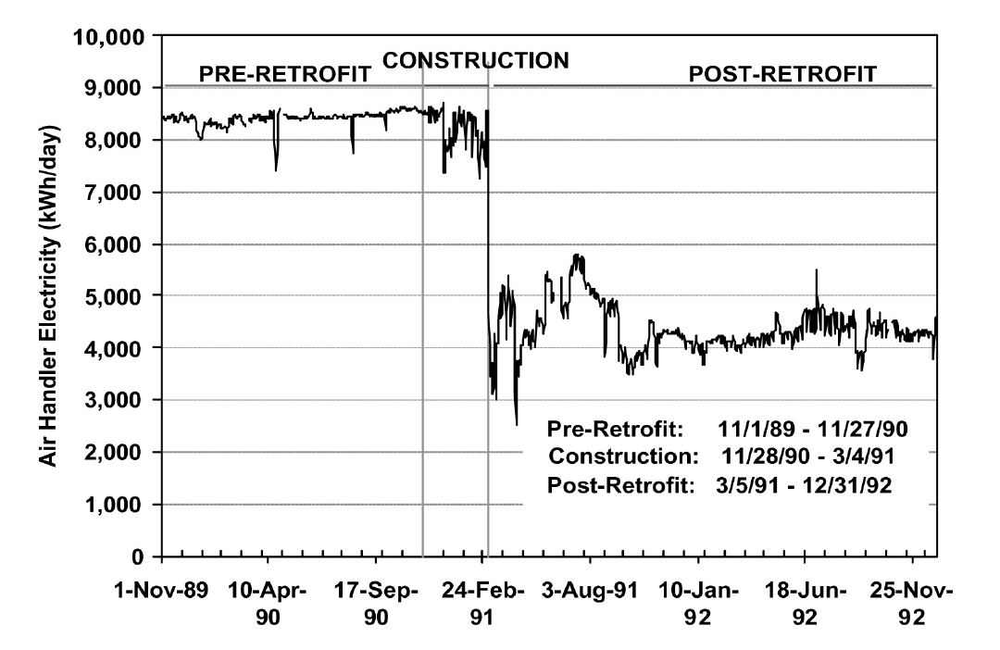
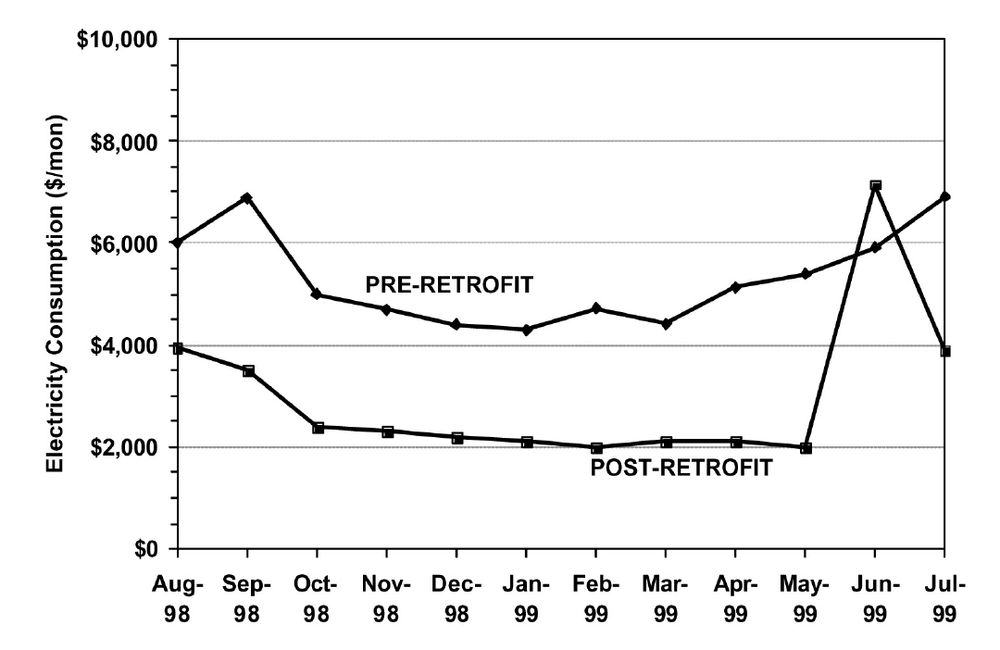

第九章 实现建筑性能的优化
==============================================

CCSM activities are essential to optimize building system operation and reduce energy consumption. To ensure excellent long-term performance and maintain the CCSM performance, the following activities should be conducted:

* Document CCSM activities
* Measure energy and maintenance cost savings
* Train operating and maintenance staff
* Measure energy data and continuously measure energy performance
* Obtain on-going assistance from CCSM engineers

This chapter discusses guidelines to perform these tasks.

9.1 连续调试项目档案
---------------------------

The documentation should be brief and accurate. The operating sequences should be documented accurately and carefully. This documentation should not repeat the existing building documentation. It should describe the procedures implemented, including control algorithms and briefly give the reasons behind these procedures. The emphasis is on accurate and usable documentation. The documentation should be easily used by operating staff. For example, operating staff should be able to create operating manuals and procedures from the document.

The CCSM project report should include the accurate documentation of current energy performance, building data, AHUs and terminal boxes, water loops and pumps, control system, and performance improvements.

9.1.1 Current energy performance
^^^^^^^^^^^^^^^^^^^^^^^^^^^^^^^^^^^^^
Before commissioning a building, the engineer should investigate the energy performance of the facility and major systems in the facility by examining the measured energy data or the utility bills. The following information should be collected and examined:

* Whole facility heating, cooling and electricity consumption data (measured
  hourly data or utility bills)
* The quality of data (bad, out of scale, or good). Ensure these data can be used
  to document the improvements of the CCSM effort.
* Briefly analyze the potential savings from CCSM efforts

9.1.2 Building
^^^^^^^^^^^^^^^^

The following information should be obtained and documented:

* Building name and location
* Building floor plan for each floor
* Special areas, such as a computer facility, operating rooms, etc., marked on
  floor plan with a brief description
* Name of AHU which serves each area marked on floor plan
* Building envelope area. Collect wall and window data and calculate heat
  transfer values
* Building comfort level. Conduct a brief walkthrough of the building and
  measure room relative humidity, CO2 and room temperature conditions.
* Comfort problems in each area
* Comfort improvements after commissioning

9.1.3 AHUs
^^^^^^^^^^^^^^^^^^^^^^^^^^^^^^^^^^^^^

The following information should be documented for each AHU:

* Single line diagram (fill in standard forms)
* Fan: hp., VFD, inlet guide vane, eddy switch or other
* VFD: hp., brand, working condition (% speed, hunting?)
* Automatic valve: type (normally open or closed), range (3-8 psi or 0 - 13 psi),
  working condition, and control (by EMCS or stand alone controller, DDC or
  pneumatic)
* Coils: inlet and outlet temperature (design and measured), differential pressure
* Dampers: working condition (adjustable or not); actuator condition
* Temperature sensors: EMCS readings and hand meter readings
* Controller: working or disabled
* Air flow: outside air flow, return air flow, maximum total flow and minimum
  total flow
* Air condition: temperature and CO2 level for outside air, return air and supply
  air
* Control sequence: cold and hot deck set points, economizer control sequence and
  static pressure control sequence
* Optimal control sequence and implementation

9.1.4 Water Loop
^^^^^^^^^^^^^^^^^^^^^^^^^^^^^^^^^^^^^

The following information should be collected for the water loop and pumps:

* Water loop riser diagram: differential pressure sensor position, temperature
  sensor position, automatic valve position, building bypass, coil bypass
* Pump: single line diagram of pump and pipe line connection, hp., VFD,
  differential pressure across pump
* VFD: condition (working, manual, bypass, damaged), % of speed or Hz,
  control logic
* Automatic valves: condition (working, bypassed), type (normally open or
  closed), operation range, location, function, position
* Control: loop control logic, differential pressure reset schedule, return
  temperature reset schedule, automatic control valve control schedule
* Water condition: building supply and return temperature, coil supply and
  return temperatures, differential pressure across building and each coil 

9.1.5 Terminal Box
^^^^^^^^^^^^^^^^^^^^^

The following information should be collected for the terminal boxes:

* Type: CV, VAV, fan-powered, DDC or pneumatic
* Design specification: minimum and maximum flow, temperature setpoint,
  thermostat location, zone floor area (sq.ft.)
* Reset schedules

9.1.6 Controller or Control System
^^^^^^^^^^^^^^^^^^^^^^^^^^^^^^^^^^^^^^^^^^

The following information should be collected for the control system:

* Control system brand and model
* Input and output for each mechanical sub-system
* Control system logic for each mechanical sub-system
* Component conditions, such as power line, pneumatic line and p/e or e/p
  switches.

9.1.7 Potential Impacts
^^^^^^^^^^^^^^^^^^^^^^^^^^^^^^^^^^^^^^^^^^

* Indoor condition improvement
* Energy consumption improvement
* Mechanical and electrical system operation improvement
* Other improvements

9.2 测量节能量
------------------------------

Most building owners expect the CCSM project to pay for itself through energy savings. Measurement of energy savings is one of the most important issues for CCSM projects. The measurement should follow the International Performance Measurement and Verification Protocol [2001 IPMVP], or other widely accepted standard methods. The process for determining savings as adopted in the IPMVP [2001] defines energy savings, Esave, as:

ESave = Ebase – Epost

where Ebase is the “baseline” energy consumption before the CCSM measures were implemented and Epost is the measured consumption following implementation of the CCSM measures.

Figure 9.1 shows the daily electricity consumption of the air handlers in a large building in which the HVAC systems were converted from constant volume systems to VAV systems using variable frequency drives. Consumption is shown for slightly longer than a year before the VFDs were installed (pre-retrofit), for about three months of construction and for about two years after installation (post-retrofit). In this case, the base daily electricity consumption is approximately 8,300 kWh/day. The post-retrofit electricity consumption is approximately 4,000 kWh/day. The electricity savings are approximately 4,300 kwh/day. During the construction period, the savings were slightly lower.

    Figure 9-1. Daily Electricity Consumption for Approximately One Year Before a Retrofit and Two Years
    After the Retrofit

However, in most cases, consumption shows more variation from day to day and month to month than shown by the fan power for these constant speed fans. Hence, determination of the baseline must consider a number of factors including weather changes, changes in occupancy schedule, changes in number of occupants, remodeling of the spaces and equipment changes.

In the IPMVP, the baseline energy use, Ebase, is determined from a model of the building operation before the retrofit (or commissioning) that uses post-installation operating conditions (e.g. weather, occupancy, etc.). The post-installation energy use is generally the measured energy use, but it may be determined from a model if measured data are not available.

The IPMVP includes four different M&V techniques or options. These options, may be summarized as Option A: some measurements, but mostly stipulated savings; Option B: measurement at the system or device level; Option C: measurement at the whole-building or facility level; and Option D: determination from calibrated simulation. Each option has advantages for certain applications.

The cost savings must also consider changes in utility rates. Since savings projections are made based on the rates in effect before the retrofit or CCSM measures are implemented, it is recommended those rates be used for any savings projections.

9.2.1 Option A - Stipulated Savings (Involving some measurements)
^^^^^^^^^^^^^^^^^^^^^^^^^^^^^^^^^^^^^^^^^^^^^^^^^^^^^^^^^^^^^^^^^^^^

The stipulated option estimates savings by measuring the capacity or the efficiency of a system before and after retrofit or commissioning and multiplying the difference by an agreed upon or “stipulated” factor such as the hours of operation, or the load on the system. This option focuses on a physical determination of equipment changes to ensure that the installation meets contract specifications. Key performance factors (e.g. lighting wattage) are determined with spot or short-term measurements. Operational factors (e.g. lighting operating hours) are stipulated based on historical data or spot measurement. Performance factors are measured or checked yearly. This method provides reliable savings estimates for applications where the energy savings are independent of weather and occupancy conditions (for most loads that are constant).

For example, during the CCSM process, the fan pulley was decreased from 18” to 16” for a constant volume AHU. The fan power savings can be determined using the following method:

* Measure the fan power consumption before changing the pulley and the power consumption after changing the pulley
* Determine the number of hours the fan operates
* Determine the fan power savings as the product of the hourly fan power energy savings and the number of hours

If the energy consumption varies with occupancy and weather conditions, this option should not be used. For example, the minimum air flow was adjusted from 50% to 0% for 100 VAV terminal boxes at night and during weekends. Since the air flow depends on both internal and external loads, the air flow may not be 0% even if the minimum flow setting is 0%. This method cannot be used to determine savings.

If the goal of the measurement is for savings determination, option A should be considered first. If it can provide the required accuracy, option A should be used.

9.2.2 Option B - Device/System Level Measurement
^^^^^^^^^^^^^^^^^^^^^^^^^^^^^^^^^^^^^^^^^^^^^^^^^^^^^^^

Within Option B, savings are determined by continuous measurements taken throughout the project term at the device or system level. Individual loads or end-uses are monitored continuously to determine performance and long-term persistence of the measures installed. The base line model can be developed using the measured energy consumption and other parameters. The energy savings can be determined as the difference of base model energy consumption and the measured energy consumption. This method provides the best savings estimation for the device or system.

The data collected can also be used to improve or optimize the system operation and are particularly valuable for Continuous CommissioningSM projects. Since measurements are taken throughout the project term, the cost is higher than option A.

9.2.3 Option C - Whole Building Level Measurement
^^^^^^^^^^^^^^^^^^^^^^^^^^^^^^^^^^^^^^^^^^^^^^^^^^^^^^^

Option C determines savings by analyzing “whole-building” or facility level data measured during the baseline period and the post-installation period. This option is required when it is desired to measure interaction effects, e.g. the impact of a lighting retrofit on the cooling consumption as well as savings in lighting energy. The data used may be utility data, or sub-metered data.

The minimum number of measurement channels recommended for performance assurance or savings measurement will be the number needed to separate heating, cooling and other electric uses. The actual number of channels will vary, depending on whether pulses are taken from utility meters, or if two or three current transformers are installed to measure the three phase power going into a chiller. Other channels may be needed, depending on the specific measures that are being evaluated.

Option C requires that installation of the proper systems/equipment and proper operating practices be confirmed. It determines savings from metered data taken throughout the project term. The major limitation in the use of Option C for savings determination is that the size of the savings must be larger than the error in the baseline model. The major challenge is accounting for changes other than those associated with the ECMs, or commissioning changes implemented.

Accurate determination of savings using Option C normally requires at least 9 months of continuous data [Reddy et al, 1992, Ruch et al, 1992, and Katipamula et al., 1995] before a retrofit, and continuous data after retrofit. However, for commissioning applications, a shorter period of data, during which daily average ambient conditions cover a large fraction of normal yearly variation, is generally adequate.

Note that monthly bills may be used to estimate the energy savings. This method is one version of Option C described above. It is typically the least expensive method of verification. It will yield reliable results under the following conditions:

* Significant savings are expected at the utility meter level
* Savings are too small to cost-justify metered data
* There will be no changes in:

    - Equipment
    - Schedules
    - Occupancy
    - Space utilization

The case shown in Figure 9.2 is an example where monthly bills clearly show the savings.

.. sidebar:: **Notes**

    Accurate determination of savings normally requires 12 months ... However, for commissioning applications, a shorter period of data during which daily average ambient conditions cover a large fraction of normal yearly variation is generally adequate.

The savings were large and consistent following the retrofit until June. At this point, a major deviation occurred. The presence of other metering at this site showed that the utility bill was incorrect. Further investigation showed that the utility meter had been changed and was not considered in the bill sent. The consumption included in this bill was greater than if the site had used the peak demand recorded on the utility meter for every hour of the billing period!

    Figure 9-2. Comparison of Monthly Utility Bills Before (Top Line) and After (Bottom Line) a Retrofit

9.2.4 Option D - Calibrated Simulation
^^^^^^^^^^^^^^^^^^^^^^^^^^^^^^^^^^^^^^^^^

Savings are determined through simulation of the facility components and/or the whole facility. The most detailed application of this approach calibrates a simulation model to baseline consumption data. For commissioning applications, it is recommended that calibration be to daily or hourly data. This type of calibration may be carried out most rapidly if simulated data are compared to measured data as a function of ambient temperature. Wei et al. [1998] have developed “energy signatures” which greatly aid this process. More information can be found from “Use of Calibrated HVAC Models to Optimize System Operation” [Liu and Claridge 1998].

Similar to the other options, the implementation of proper operating practices should be confirmed. It is particularly important that personnel, experienced in the use of the particular simulation tool, conduct the analysis. The simulation analysis must be well documented, with electronic and hard copies of the simulation program input and output archived.

9.3 培训运行维护人员
---------------------------------------------

Efficient building operation begins with a qualified and committed staff. Since the CCSM process generally makes changes in the way a building is operated in order to improve comfort and efficiency, it is essential that the operators be a part of the commissioning team. They must work with the CCSM engineers, propose CCSM measures and implement or help implement them. In addition to actively participating in the CCSM process, formal technical training should be provided to ensure that the operating staff understands the procedures implemented so they can perform trouble-shooting properly.

9.4 持续测量能耗性能
----------------------------------------------

The measurement of energy consumption data is very important to maintain building performance and maintain CCSM savings. The metered data can be used to: 

*   Identify and solve problems. Metered consumption data is needed to ensure
    the building is still operating properly. If there is a component failure or an
    operating change that makes such a small change in comfort or operating
    efficiency that it is not visible in metered constumption data, it generally is not
    worth worrying about. If it does show up as even a marginal increase in
    consumption, trouble-shooting should be initiated.
*   Trend/measure energy consumption data. This continuing acivity is the first
    line of defense against declining performance. The same procedures used to
    establish a pre-CCSM baseline can be used to establish a baseline for post-CCSM
    performance. This post-CCSM baseline can be used as a standard to which
    future performance is compared. Consumption that exceeds this baseline for
    a few days or even a month may not be significant, but if it persists much more
    than a month, trouble-shooting should be used to discover what led to the
    increase. If it is the result of a malfunctioning valve, it can be fixed. If it is the
    result of 100 new computers added to the building, adjust the base line
    accordingly.
*   Trend and check major operating parameters. Parameters such as cold-deck
    temperatures, zone supply temperatures, etc. should be trended periodically for
    comparison with historic levels. This can be extremely valuable when trouble-
    shooting and investigating consumption above the post-CCSM baseline.
    * Find the real problems when the system needs to be repaired or fixed. It is
    essential that the same fundamental approach, used to find and fix problems
    while the CCSM process is initiated, be used whenever new hot calls or cold calls
    are received.

9.5 如有必要可以采用专家决策
----------------------------------------

It is inevitable that a problem will arrive, which after careful trouble-shooting will point toward a problem with one or more of the CCSM measures which have been implemented. Ask the CCSM providers for help in solving such problems before undoing an implemented CCSM measure. Sometimes it will be necessary to modify a measure that has been implemented. The CCSM engineers will often be able to help find the most efficient solution, or find another explanation so the problem can be remedied without changing the measure.

Ask help from the CCSM providers when a new problem or situation is encountered. Problems occasionally crop up that defy logical explanation. These problems are generally resolved by trying one of several things that seem like possible solutions and playing with system settings until the problem goes away. This is one of the most important situations in which expert help is needed. These are precisely the kind of problems, and the trial and error solutions, which often lead to major operating cost increases.

**References**

Katipamula, S., Reddy, T.A., and Claridge, D.E., 1995. “Effect of Time Resolution on Statistical Modeling of Cooling Energy Use in Large Commercial Buildings,” ASHRAE Transactions-Research. Volume 101, Part 2, pp. 321-334.

Liu, M., D.E. Claridge, 1998. “Use of Calibrated HVAC Models to Optimize System Operation,” ASME Journal of Solar Energy Engineering, Vol. 120, pp. 131-138.

Reddy, T. A., Kissock, K. and Claridge, D. E., 1992. “Uncertainty Analysis in Estimating Building Energy Retrofit Savings in the LoanSTAR Program,” Proceedings of the ACEEE 1992 Summer Study on Energy Efficiency in Buildings, Volume 3, American Council for an Energy Efficient Economy, Washington, D.C., pp. 225-237.

Ruch, D. K. and Claridge, D. E., 1992. “NAC for Linear and Change-Point Building Energy Models,” Proceedings of the ACEEE 1992 Summer Study on Energy Efficiency in Buildings, Volume 3, American Council for an Energy Efficient Economy, Washington, D.C., pp. 263-274.

Wei, G., M. Liu and D.E. Claridge, 1998, “Signatures of Heating and Cooling Energy Consumption for Typical AHUs,” The Eleventh Symposium on Improving Building Systems in Hot and Humid Climates Proceedings, June 1-2, 1998, Ft. Worth, Texas, pp. 387-402.

